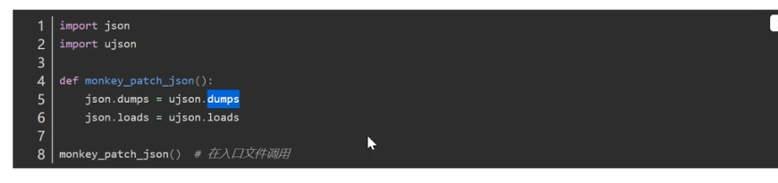
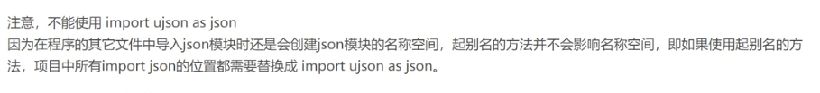

处理的问题

当使用某个模块时对某个功能不满意，希望自定义这个功能，这个过程就是打补丁(猴子补丁)。

核心:在导入模块后,用自己的代码去替换模块的源代码，而这一操作需要在程序的**入口文件**中完成。
模块导入的特点:如果对同-模块进行重复导入,后续的导入会直接引入第一次导入的结果。 因此应该在首次导入时对模块打补丁。
为了确定首次导入的文件,可以在**入口文件**start.py中导入模块并打补丁。
例如ujson模块提供的方法在效率上比json模块相应方法更高。
用ujson模块的dumps()和loads0去替换json模块中的相应方法。

