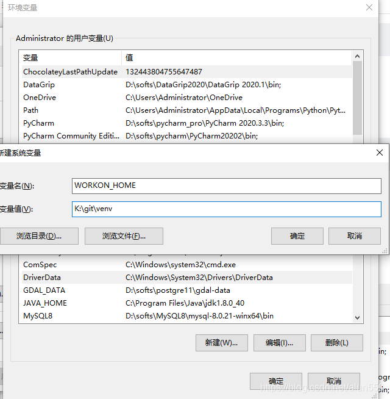

1、安装 virtualenvwrapper

 pip install -i https://pypi.tuna.tsinghua.edu.cn/simple virtualenvwrapper-win


2以 WORKON_HOME 为名，值选择一个目录，以后所有使用virtualenvwrapper管理的虚拟环境都会在这个目录中



创建虚拟环境

```
mkvirtualenv -p 3.6 python_notebook
```
删除虚拟环境

 rmvirtualenv 虚拟环境名

列出蓄力环境

workon

激活虚拟环境

workon 虚拟环境名


列出蓄力环境安装的报名

```
pip freeze >requirements.txt
```

