『原神』2.6无限抽卡端搭建教程

aoruLola

1天前 小米10S

注意：这个端是外网泄露的，github上有大佬做了整合，我只是教程翻译搬运以及部分解答。出现的任何问题概不负责

注意2：由于我学校网络不好我也没那么多流量，所以提供不了网盘下载，大家自备吧

准备工作：

java8（下载链接：[查看链接](https://mirrors.huaweicloud.com/java/jdk/8u202-b08/jdk-8u202-windows-x64.exe)
Mongodb（官网链接：www.mongodb.com

以上两个软件下载直接安装即可，无需配置，教程略，有问题评论区

第一，服务端搭建

1、首先我们打开github，搜索grasscutter，看见如图Grasscutters/Grasscutter，点进去右下角找到releases，点进去一直翻下去找到assets，下载grasscutter.jar，放置本地文件夹备用

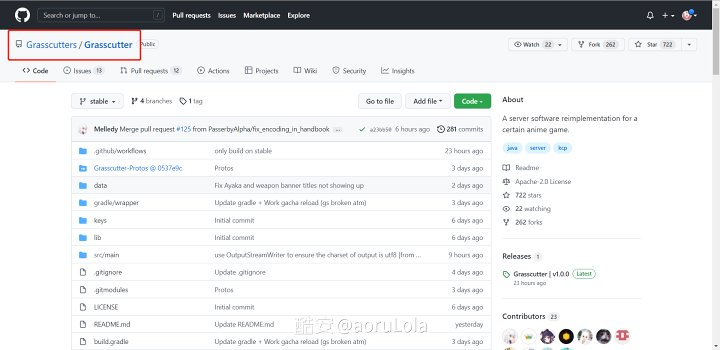

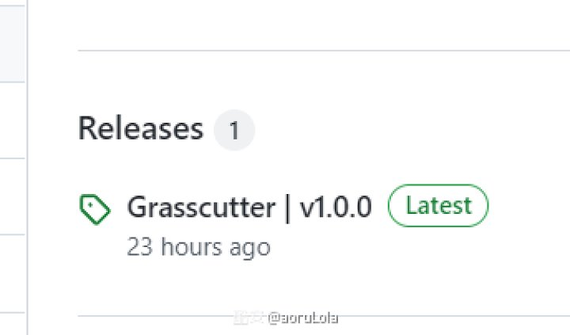

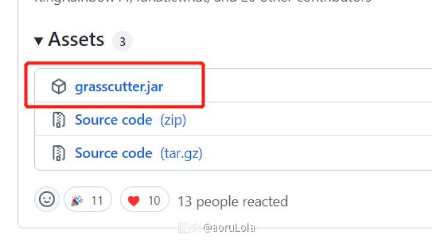

或者直接打开链接[查看链接](https://github.com/Grasscutters/Grasscutter/releases/tag/v1.0.0)

2、在grasscutter.jar那个文件夹新建一个文本文档并改名为start.bat，右键编辑，输入

java -jar grasscutter.jar

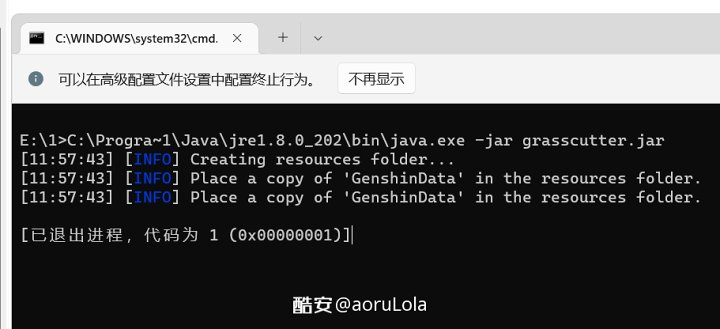

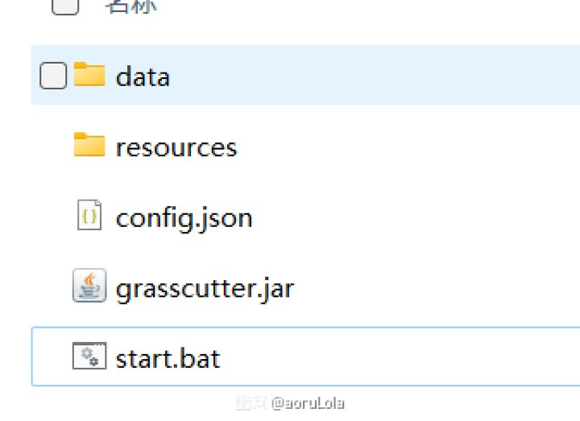

保存，并双击运行，看见提示退出或者黑框没了就关掉黑框，这时文件夹里面又有了文件夹

注意：如果系统提示java不是可运行什么的，在下方留言我帮你解决

3、重点!
复制GenshinData里面所有文件到
resources；
下载链接：[查看链接](https://github.com/Dimbreath/GenshinData)

复制gi-bin-output里面所有文件到 
resources/BinOutput；
下载链接：[查看链接](https://github.com/radioegor146/gi-bin-output)

复制Grasscutter-Protos到proto文件夹，没有就新建
下载链接：[查看链接](https://github.com/Grasscutters/Grasscutter-Protos/tree/main/proto)

复制Keys 里面文件到 keys文件夹，没有就新建
下载链接：[查看链接](https://github.com/Melledy/Grasscutter/tree/main/keys)

复制Game Data里面文件到data
下载链接：[查看链接](https://github.com/Melledy/Grasscutter/tree/main/data)

复制keystore.p12跟jar同一个目录
下载链接：
[查看链接](https://github.com/Melledy/Grasscutter/blob/main/keystore.p12)

由于翻译效果和时间关系，我不能很详细像教小孩子一样叫你，你实在看不懂就在评论区问我，附上教程原图

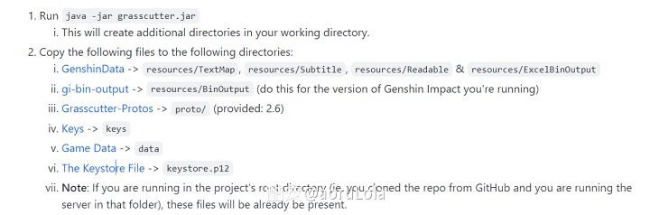

4、没有意外的话，运行start.bat，看见黑色框框并且显示如图内容，开服成功。下面我教你然后连接。

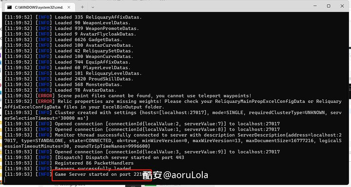

第二、客户端连接
如果你会劫持转发流量的话，按照下表劫持流量即可，转发到你服务端

如果你不会，那就跟我来

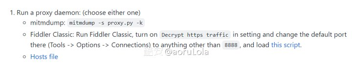

原贴给了3种办法，我这里说fiddler法
1、下载fiddler，这个自行下载安装
2、打开fiddler，点菜单栏Tools-Options

在HTTPS页选中Decrypt HTTPS traffic

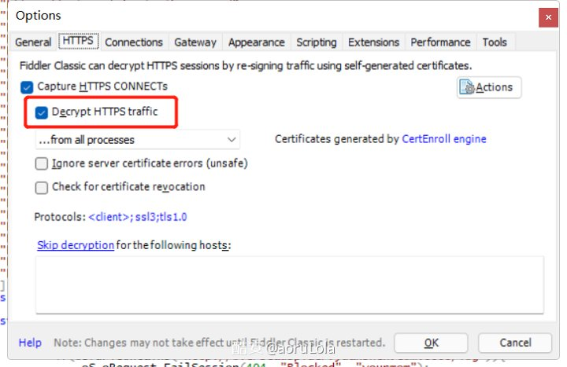

在connections页把端口改成8181

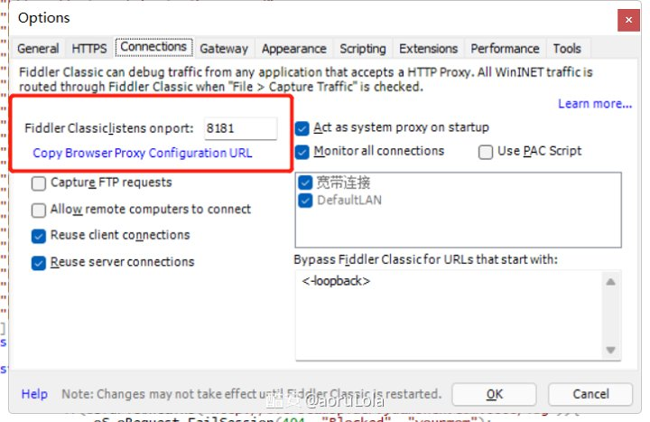

点击OK保存

3、在fiddler主页找到FiddlerScript
删除原有并粘贴以下内容，点击Save Script

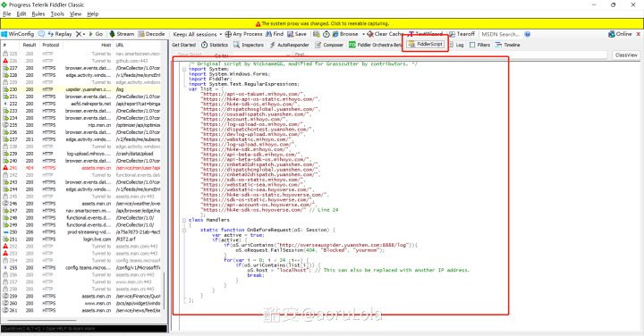

脚本链接：[查看链接](https://github.lunatic.moe/fiddlerscript)

如果没意外，那么先打开fiddler，然后打开您的官服客户端，会弹出信任证书的提示框，那就成功了点击yes即可。

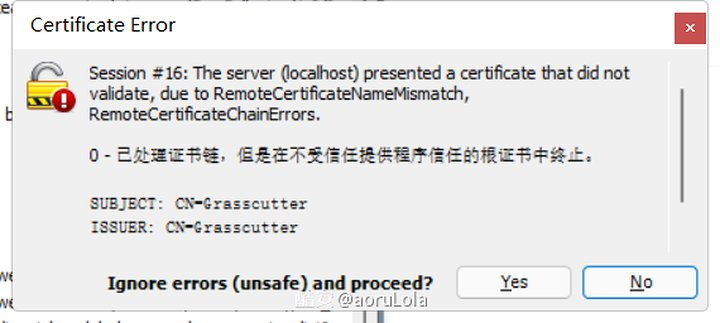

登录页面是国际服，显示hoyoverse的。创建账号请看下面，不要用自己的国际服账号登录（虽然也登不上

如果您中途退出过游戏或者推出账号或者其他奇奇怪怪的问题，请把客户端和fiddler全部关掉，重新打开fiddler，再打开客户端

第三，游玩
首先在控制台输入
1、account create 用户名 随便编一个UID
如：account create aorulola 100000000
创建一个用户

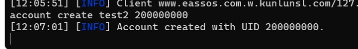

回到客户端，输入用户名，密码随便写，就可以登录了

2、经过小小的开场动画后，你就可以用以下指令了（在服务端或者客户端输入都可以，客户端输入需要在聊天框找到server这个人，并且命令要带/，比如/give 100000000 223 1000

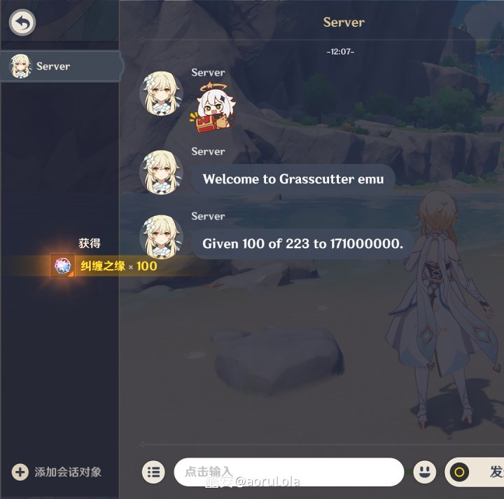

可以用的指令如图，我也不翻译了，大家自己折腾吧，记得用户ID就是填UID，物品ID列表点这里下载： [查看链接](https://pan.baidu.com/s/1JNbWlYGK5sQb98Hvd6WCAw) 提取码: r8hf

我知道你在找什么：/give UID 223 100
223是纠缠之缘，224是相遇之缘

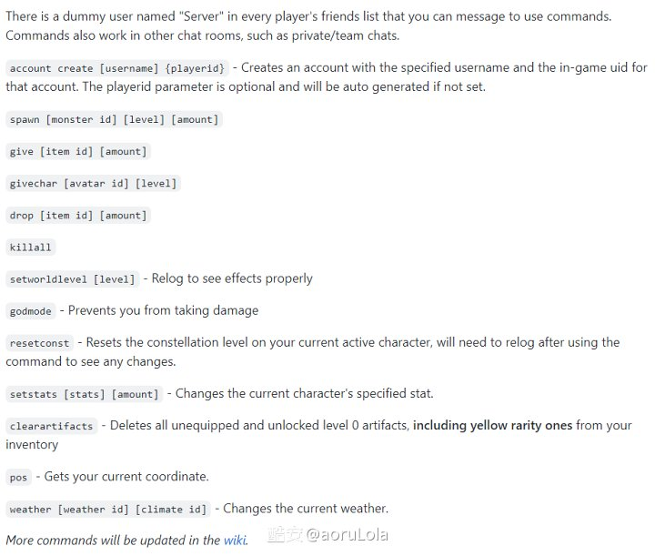

抽卡的概率比较离谱，可能是没有大数据干预，武器池好多次是第80个十连才出，也没有定轨系统，但也试过连续3个十连都有金

已知bug：
1、命座效果不能实现，已测试魈和绫华，魈6命但是只有0命功能
2、绫华技能无伤害，不能遁地（遁地会卡住）
3、不能传送
4、抽卡太多会炸号，服务端重新创建即可

如果你有服务器，还能给别人直接连上去玩，就免去别人搭建服务端一步，只是劫持脚本要把IP改为服务器IP。为了规避法律问题，我就不提供给大家连接了，大家想玩自己搭吧，Have fun!