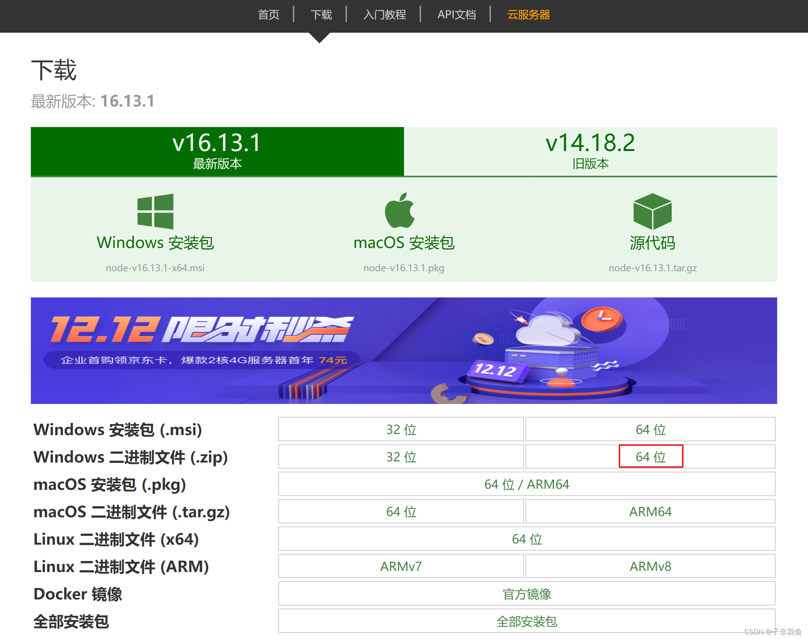

1 安装nods

官网：http://nodejs.cn/
下载地址：http://nodejs.cn/download/

二进制文件操作如下

在解压的目录下创建node_cache和node_global两个文件夹

然后配置环境变量

在 高级系统设置 -> [环境变量](https://so.csdn.net/so/search?q=环境变量&spm=1001.2101.3001.7020) -> 系统变量，

1	新建NODE_PATH，如果变量已经存在就直接修改值，值为

D:\node-v16.14.2-win-x64\node_modules

2 D:\node-v16.14.2-win-x64\

3 D:\node-v16.14.2-win-x64\node_global

然后执行命令

npm config set prefix D:\node-v16.14.2-win-x64\node_global

npm config set cache D:\node-v16.14.2-win-x64\node_cache

换原命令

npm  install  -g  cnpm  --registry=https://registry.npm.taobao.org