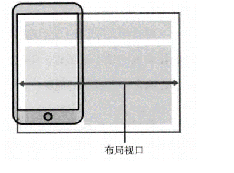

## 移动web开发流式布局

### 1.0 移动端基础

兼容移动端主流浏览器，处理Webkit内核浏览器即可。

### 2.0 视口

视口（viewport）就是浏览器显示页面内容的屏幕区域。 视口可以分为布局视口、视觉视口和理想视口

#### 2.1 布局视口 layout viewport

一般移动设备的浏览器都默认设置了一个布局视口，用于解决早期的PC端页面在手机上显示的问题。

iOS, Android基本都将这个视口分辨率设置为 980px，所以PC上的网页大多都能在手机上呈现，只不过元素看上去很小，一般默认可以通过手动缩放网页。

#### 2.2视觉视口 visual viewport

字面意思，它是用户正在看到的网站的区域。注意：是网站的区域。

我们可以通过缩放去操作视觉视口，但不会影响布局视口，布局视口仍保持原来的宽度。

#### 2.3理想视口 ideal viewport

为了使网站在移动端有最理想的浏览和阅读宽度而设定

理想视口，对设备来讲，是最理想的视口尺寸

需要手动添写meta视口标签通知浏览器操作

meta视口标签的主要目的：布局视口的宽度应该与理想视口的宽度一致，简单理解就是设备有多宽，我们布局的视口就多宽

**总结：我们开发最终会用理想视口，而理想视口就是将布局视口的宽度修改为视觉视口**

### 3.0meta标签

| 属性          | 解释说明                                         |
| :------------ | :----------------------------------------------- |
| width         | 宽度设置的是viewport，可以设置device-width特殊值 |
| initial-scale | 初始缩放比，大于0的数字                          |
| maximum-scale | 最大缩放比，大于0的数字                          |
| minimum-scale | 最小缩放比，大于0的数字                          |
| user-scalable | 用户是否可以缩放，yes或no（1或0）                |

最标准的viewport设置

+ 视口宽度和设备保持一致
+ 视口的默认缩放比例1.0
+ 不允许用户自行缩放
+ 最大允许的缩放比例1.0
+ 最小允许的缩放比例1.0

### 4.0物理像素&物理像素比

物理像素点:指的是屏幕显示的最小颗粒，是物理真实存在的

屏幕像素比:我们开发时候的1px 不是一定等于1个物理像素的一个px的能显示的物理像素点的个数，称为物理像素比或屏幕像素比

#### 4.1二倍图

~~~html
<!DOCTYPE html>
<html lang="en">

<head>
    <meta charset="UTF-8">
    <meta name="viewport" content="width=device-width, initial-scale=1.0">
    <meta http-equiv="X-UA-Compatible" content="ie=edge">
    <title>Document</title>
    
</head>

<body>
    <!-- 模糊的 -->
    
    <!-- 我们采取2倍图 -->
    
</body>

</html>
~~~