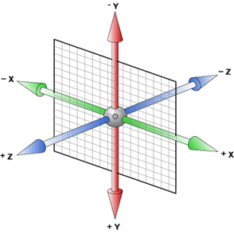
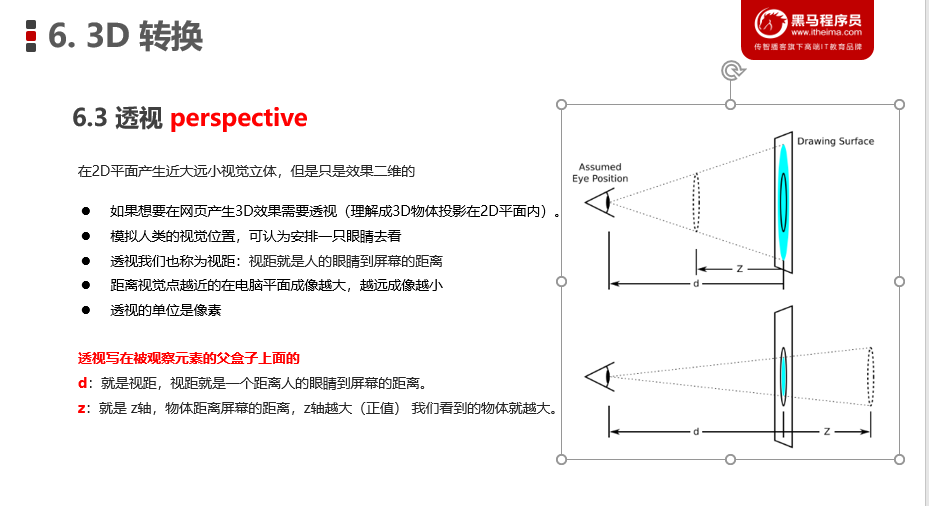
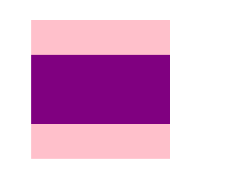

### 3D转换

#### 特点

- 近大远小。
- 物体后面遮挡不可见

#### 三维坐标系

lx轴：水平向右   注意： x 右边是正值，左边是负值 

ly轴：垂直向下   注意： y 下面是正值，上面是负值

lz轴：垂直屏幕   注意： 往外面是正值，往里面是负值 

#### 3D移动 translate3d

ltranslform:translateX(100px)：仅仅是在x轴上移动

ltranslform:translateY(100px)：仅仅是在Y轴上移动

ltranslform:translateZ(100px)：仅仅是在Z轴上移动（注意：translateZ一般用px单位）

ltransform:translate3d(x,y,z)：其中 x、y、z 分别指要移动的轴的方向的距离 

#### 3D **transfrom-style** 

- 控制子元素是否开启三维立体环境。。
- transform-style: flat 子元素不开启3d立体空间 默认的
- transform-style: preserve-3d; 子元素开启立体空间
- **代码写给父级，但是影响的是子盒子**
- 这个属性很重要，后面必用

未开启三维环境

~~~~html
<!DOCTYPE html>
<html lang="en">

<head>
    <meta charset="UTF-8">
    <meta name="viewport" content="width=device-width, initial-scale=1.0">
    <meta http-equiv="X-UA-Compatible" content="ie=edge">
    <title>Document</title>
    
</head>

<body>
    

        

        

    

</body>

</html>
~~~~

开启了三维环境

~~~~
<!DOCTYPE html>
<html lang="en">

<head>
    <meta charset="UTF-8">
    <meta name="viewport" content="width=device-width, initial-scale=1.0">
    <meta http-equiv="X-UA-Compatible" content="ie=edge">
    <title>Document</title>
    
</head>

<body>
    

        

        

    

</body>

</html>
~~~~

