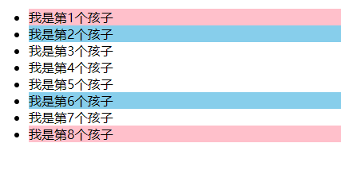
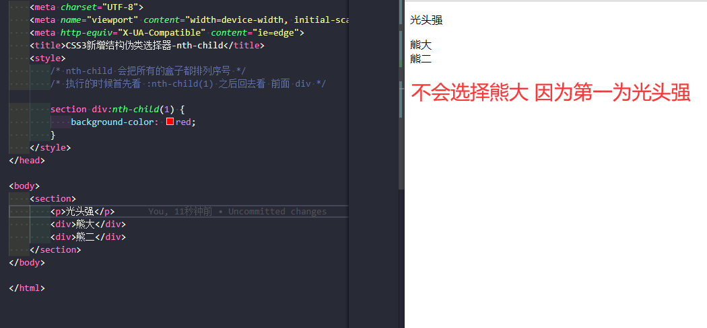
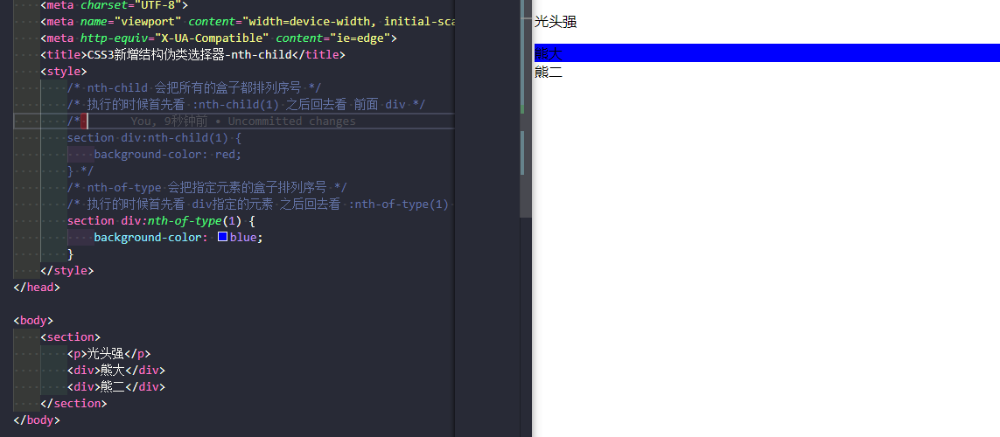

### 属性

结构伪类选择器主要根据文档结构来选择元素，常用于选择父级选择器里的子元素

| 选择符           | 简介                        |
| ---------------- | --------------------------- |
| E:first-child    | 匹配父元素中的第一个子元素E |
| E:last-child     | 匹配父元素中最后一个子元素E |
| E:nth-child(n)   | 匹配父元素中的第n个子元素E  |
| E:first-of-ytpe  | 指定类型E的第一个           |
| E:last-of-type   | 指定类型E的最后一个         |
| E:nth-of-type(n) | 指定类型E的第n个            |

#### E:nth-child(n)

~~~
<!DOCTYPE html>
<html lang="en">

<head>
    <meta charset="UTF-8">
    <meta name="viewport" content="width=device-width, initial-scale=1.0">
    <meta http-equiv="X-UA-Compatible" content="ie=edge">
    <title>CSS3新增结构伪类选择器</title>
    
</head>

<body>
    <ul>
        <li>我是第1个孩子</li>
        <li>我是第2个孩子</li>
        <li>我是第3个孩子</li>
        <li>我是第4个孩子</li>
        <li>我是第5个孩子</li>
        <li>我是第6个孩子</li>
        <li>我是第7个孩子</li>
        <li>我是第8个孩子</li>
    </ul>
</body>

</html>
~~~

**n** 可以是数字或者公式；2n偶数even；2n+1奇数odd；n从零开始 越等越循环中的0到末尾

~~~
<!DOCTYPE html>
<html lang="en">

<head>
    <meta charset="UTF-8">
    <meta name="viewport" content="width=device-width, initial-scale=1.0">
    <meta http-equiv="X-UA-Compatible" content="ie=edge">
    <title>CSS3新增结构伪类选择器-nth-child</title>
    
</head>

<body>
    <ul>
        <li>我是第1个孩子</li>
        <li>我是第2个孩子</li>
        <li>我是第3个孩子</li>
        <li>我是第4个孩子</li>
        <li>我是第5个孩子</li>
        <li>我是第6个孩子</li>
        <li>我是第7个孩子</li>
        <li>我是第8个孩子</li>
    </ul>
    <ol>
        <li>我是第1个孩子</li>
        <li>我是第2个孩子</li>
        <li>我是第3个孩子</li>
        <li>我是第4个孩子</li>
        <li>我是第5个孩子</li>
        <li>我是第6个孩子</li>
        <li>我是第7个孩子</li>
        <li>我是第8个孩子</li>
    </ol>
</body>

</html>
~~~

#### E:first-of-ytpe

~~~
<!DOCTYPE html>
<html lang="en">

<head>
    <meta charset="UTF-8">
    <meta name="viewport" content="width=device-width, initial-scale=1.0">
    <meta http-equiv="X-UA-Compatible" content="ie=edge">
    <title>CSS3新增结构伪类选择器-nth-child</title>
    
</head>

<body>
    <ul>
        <li>我是第1个孩子</li>
        <li>我是第2个孩子</li>
        <li>我是第3个孩子</li>
        <li>我是第4个孩子</li>
        <li>我是第5个孩子</li>
        <li>我是第6个孩子</li>
        <li>我是第7个孩子</li>
        <li>我是第8个孩子</li>
    </ul>
</body>

</html>
~~~

### 两者区别

1. `nth-child` 对父元素里面所有孩子排序选择（序号是固定的）先找到第`n` 个孩子，然后看看是否匹配
2. `nth-of-type` 对父元素里面指定子元素排序选择。先去匹配`E` ，然后再根据`E` 找第`n` 个孩子

