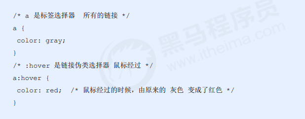
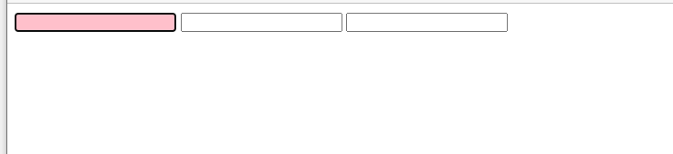

### 链接伪类选择器

格式写法

| 值      | 描述                                                    |
| ------- | ------------------------------------------------------- |
| link    | 未访问的链接 a:link  把没有点击过的(访问过的)链接选出来 |
| visited | 选择点击过的(访问过的)链接                              |
| hover   | 选择鼠标经过的那个链接                                  |
| active  | 选择的是我们鼠标正在按下还没有弹起鼠标的那个链接        |
|         |                                                         |

active是右键点击效果

~~~
<!DOCTYPE html>
<html lang="en">

<head>
    <meta charset="UTF-8">
    <meta name="viewport" content="width=device-width, initial-scale=1.0">
    <meta http-equiv="X-UA-Compatible" content="ie=edge">
    <title>复合选择器之链接伪类选择器</title>
    
</head>

<body>
    <a href="#">小猪佩奇</a>
    <a href="http://www.xxxxxxxx.com">未知的网站</a>
</body>

</html>
~~~

### focus伪类选择器

解释选择以后

~~~
<!DOCTYPE html>
<html lang="en">

<head>
    <meta charset="UTF-8">
    <meta name="viewport" content="width=device-width, initial-scale=1.0">
    <meta http-equiv="X-UA-Compatible" content="ie=edge">
    <title>focus伪类选择器</title>
    
</head>

<body>
    <input type="text">
    <input type="text">
    <input type="text">
</body>

</html>
~~~

