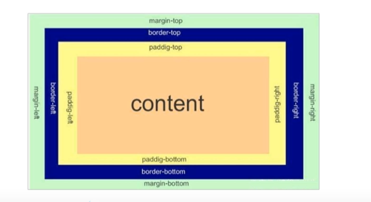
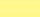
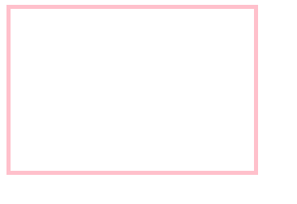
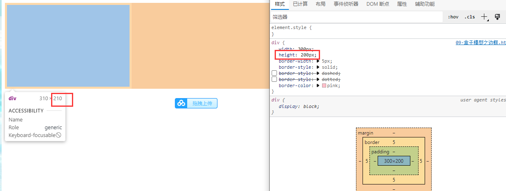
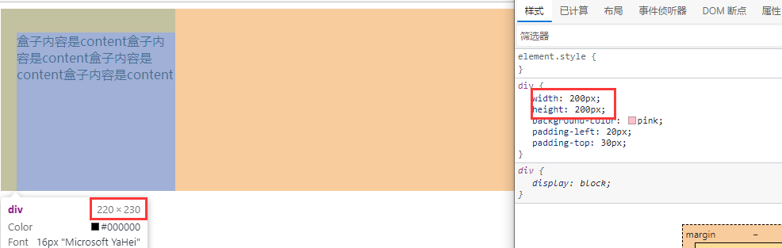
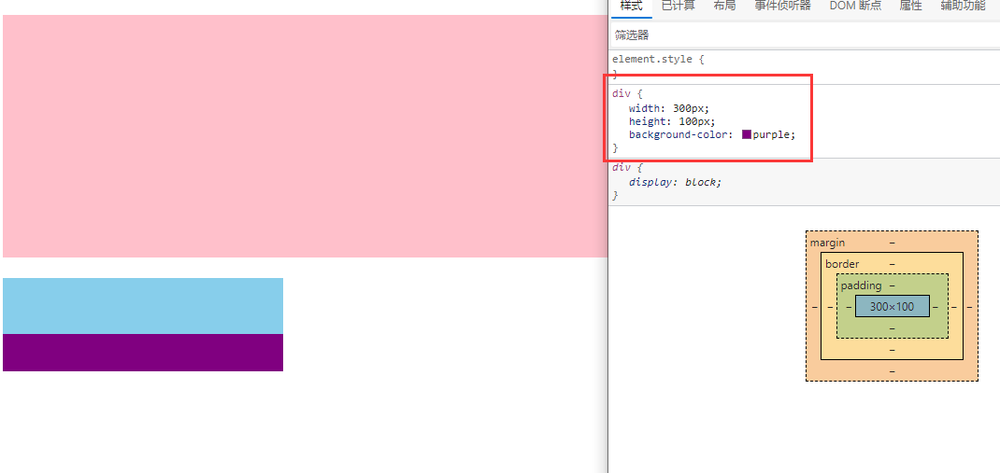
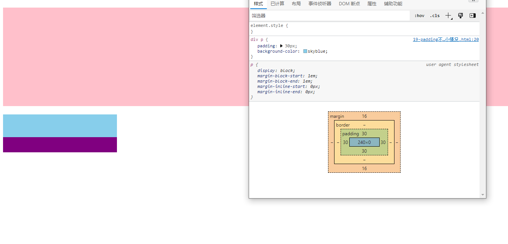
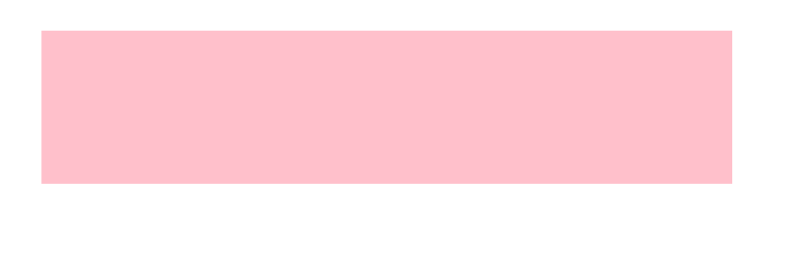

### css盒子模型

margin 外边距 

border 边距 

padding内边距

conten类容

#### 外边距

| 属性          | 作用     |
| ------------- | -------- |
| margin-left   | 左外边距 |
| margin-right  | 右外边距 |
| margin-top    | 上外边距 |
| margin-bottom | 下外边距 |

#### 边框

| 属性         | 作用     |
| ------------ | -------- |
| margin-width | 边框粗细 |
| margin-style | 边框样式 |
| border-color | 边框颜色 |

~~~
<!DOCTYPE html>
<html lang="en">
<head>
    <meta charset="UTF-8">
    <meta name="viewport" content="width=device-width, initial-scale=1.0">
    <meta http-equiv="X-UA-Compatible" content="ie=edge">
    <title>盒子模型之边框</title>
    
</head>
<body>
    

</body>
</html>
~~~

边框简写可以用

border: 1px solid red; 没有顺序 

##### 注意

会撑大盒子

#### 内边距

| 值的个数                    | 表达意思                                                 |
| --------------------------- | -------------------------------------------------------- |
| padding :5px                | 1个值，代表上下左右都有5像素内边距;                      |
| padding :5px 10px           | 2个值，代表上下内边距是5像索左右内边距是10像素;          |
| padding :5px 10px 20px      | 3个值，代表上内边距5像素左右内边距10像素 下内边距20像素; |
| padding :5px 10px 20px 30px | 4个值， 上是5像素右10像素下20像素左是30像素 顺时针       |
|                             |                                                          |

#### 注意

如果盒子已经有了宽度和高度，此时再指定边框，会撑大盒子

~~~
<!DOCTYPE html>
<html lang="en">
<head>
    <meta charset="UTF-8">
    <meta name="viewport" content="width=device-width, initial-scale=1.0">
    <meta http-equiv="X-UA-Compatible" content="ie=edge">
    <title>盒子模型之内边距</title>
    
</head>
<body>
    

        盒子内容是content盒子内容是content盒子内容是content盒子内容是content
    

</body>
</html>
~~~

不会影响盒子大小的情况

不会撑大父亲盒子

~~~
<!DOCTYPE html>
<html lang="en">
<head>
    <meta charset="UTF-8">
    <meta name="viewport" content="width=device-width, initial-scale=1.0">
    <meta http-equiv="X-UA-Compatible" content="ie=edge">
    <title>padding不会影响盒子大小的情况</title>
    
</head>
<body>
   <h1></h1>
   

       

   

</body>
</html>
~~~

### 盒子案例

#### 外边距块级盒子居中案例

外边距可以让**块级盒子**水平居中，但是必须满足两个条件：

① 盒子必须指定了宽度（width）。

 ② 盒子左右的外边距都设置为 auto 。

一般初始化会写

~~~
.header{
width:960px;
margin:0 auto;
}
~~~

是header模块 宽度为960px内容居中上下边距为0

以下写法也可以

~~~html
margin-left: auto; 

margin-right: auto; 

margin: auto;  margin: 0 auto;
~~~

~~~
<!DOCTYPE html>
<html lang="en">
<head>
    <meta charset="UTF-8">
    <meta name="viewport" content="width=device-width, initial-scale=1.0">
    <meta http-equiv="X-UA-Compatible" content="ie=edge">
    <title>块级盒子水平居中对齐</title>
    
</head>
<body>
    

</body>
</html>
~~~

##### 