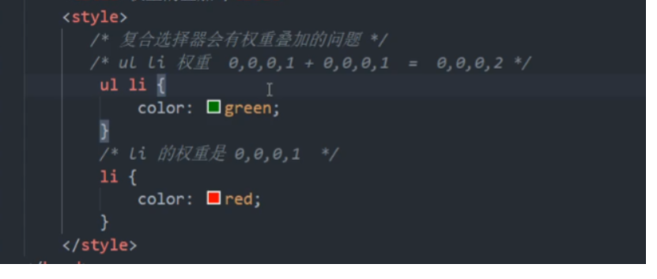

##### 层叠性

相同样式会覆盖

- 样式冲突：就近原则（从上往下，类似方法重写）
- 样式不冲突，不进行层叠

##### 继承性

子标签会继承父标签的某些样式

- 简化代码，降低css复杂性
- 子元素可以继承父元素的样式（`text- ,font- ,line- ,`这些元素开头的可以继承，以及`color`属性）

###### 行高继承性

```css
body{
    font :12px/1.5 Microsoft YaHei
}
```

- 行高可以不跟单位：`1.5`表当前文字大小的1.5倍
- 子元素可以根据自己文字大小自动调整行高

##### 优先级

当同一个元素指定多个选择器

- 选择器相同，执行层叠性
- 不同，根据权重执行

| 选择器               | 选择器权重 |
| -------------------- | ---------- |
| 继承或者 *           | 0 0 0 0    |
| 元素选择器           | 0 0 0 1    |
| 类选择器，伪类选择器 | 0 0 1 0    |
| id选择器             | 0 1 0 0    |
| 行内样式style=””     | 1 0 0 0    |
| !important           | 无穷大     |

> ```css
> div {
>  color: red!important;
> }
> ```

###### 权重叠加

复合选择器会有权重叠加的问题

> 
>
> 范围越小，权重越大
>
> `ul li`的权重叠加高于`li`的权重，不会进位

~~~
<!DOCTYPE html>
<html lang="en">
<head>
    <meta charset="UTF-8">
    <meta name="viewport" content="width=device-width, initial-scale=1.0">
    <meta http-equiv="X-UA-Compatible" content="ie=edge">
    <title>权重的叠加</title>
    <style>
       /* 复合选择器会有权重叠加的问题 */
       /* 权重虽然会叠加,但是永远不会有进位 */
       /* ul li 权重  0,0,0,1 + 0,0,0,1  =  0,0,0,2     2 */
        ul li {
            color: green;
        }
        /* li 的权重是 0,0,0,1    1 */
        li {
            color: red;
        }
        /* .nav li  权重    0,0,1,0  +  0,0,0,1  =  0,0,1,1    11 */
        .nav li {
            color: pink;
        }
    </style>
</head>
<body>
    <ul class="nav">
        <li>大猪蹄子</li>
        <li>大肘子</li>
        <li>猪尾巴</li>
    </ul>
</body>
</html>
~~~

