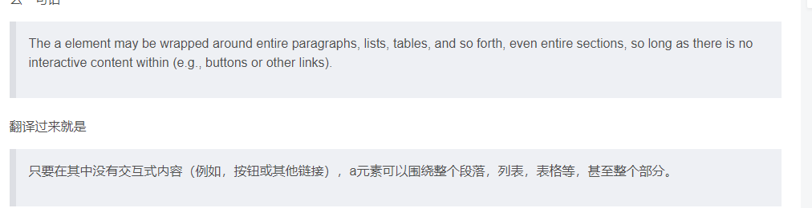
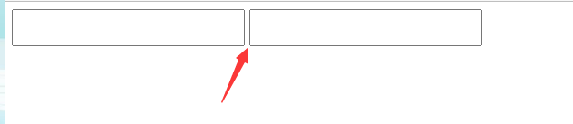

### 块元素

常见的块元素有

~~~
<h1>~<h6>、
、
、<ul>、<ol>、<li> 
 
~~~

 div为用的最多的块级元素

#### 特点

1. 自己独占一行
2. 高度，宽度、外边距以及内边距都可以控制。
3. 宽度默认是容器（父级宽度）的100%。
4. 是一个容器及盒子，里面可以放行内或者块级元素。

文字类的元素内不能使用块级元素

就是
 <h1>....等都是文字类块级标签，里面也不能放其他块级元素

### 行内元素

~~~
常见的行内元素有 <a>、<strong>、<b>、<em>、<i>、<del>、<s>、<ins>、<u>、等，其中
 标签是最典型的行内元素。有的地方也将行内元素称为内联元素。
~~~

#### 特点

1. 相邻行内元素在一行上，一行可以显示多个。
2. 高、宽直接设置是无效的。
3. 默认宽度就是它本身内容的宽度。
4. 行内元素只能容纳文本或其他行内元素。

**链接里面不能再放链接**

~~~html
<a href="#">
    

		some code here
        <a href="#">go to some where</a>
    

</a>  
~~~

特殊情况链接  里面可以放块级元素，但是给  转换一下块级模式最安全

### 行内块元素

~~~
 、<input />、<td>
~~~

#### 特点

① 和相邻行内元素（行内块）在一行上，但是他们之间会有空白缝隙。一行可以显示多个（行内元素特点）。 

② 默认宽度就是它本身内容的宽度（行内元素特点）。 

③ 高度，行高、外边距以及内边距都可以控制（块级元素特点）。

~~~
<!DOCTYPE html>
<html lang="en">

<head>
    <meta charset="UTF-8">
    <meta name="viewport" content="width=device-width, initial-scale=1.0">
    <meta http-equiv="X-UA-Compatible" content="ie=edge">
    <title>显示模式之行内块元素(特殊情况)</title>
    
</head>

<body>
    <input type="text">
    <input type="text">
</body>

</html>
~~~

### 元素显示模式转换

 转换为块元素：display:block; 

 转换为行内元素：display:inline; 

 转换为行内块：display: inline-block;

~~~html
<!DOCTYPE html>
<html lang="en">

<head>
    <meta charset="UTF-8">
    <meta name="viewport" content="width=device-width, initial-scale=1.0">
    <meta http-equiv="X-UA-Compatible" content="ie=edge">
    <title>元素显示模式转换</title>
    
</head>

<body>
    <a href="#">金星阿姨</a>
    <a href="#">金星阿姨</a>
    
我是块级元素

    
我是块级元素

    行内元素转换为行内块元素
    行内元素转换为行内块元素
</body>

</html>
~~~

