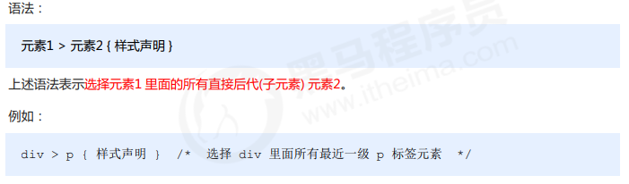
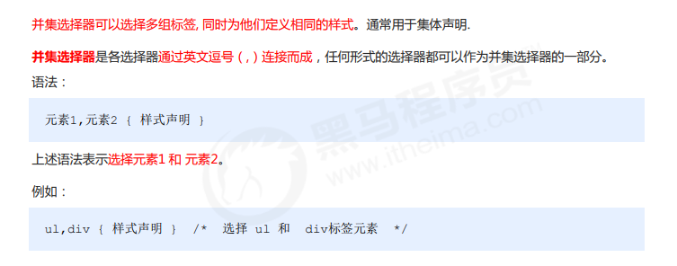

## 复合选择器

### 后代选择器 (重要）

~~~
元素1 元素2 { 样式声明 }
~~~

**上述**语法表示选择 元素1 里面的所有元素 2 (后代元素)。

例如

~~~
ul li { 样式声明 } /* 选择 ul 里面所有的 li标签元素 */
~~~

元素1 和 元素2 中间用空格隔开

元素1 是父级，元素2 是子级，最终选择的是元素2

元素2 可以是儿子，也可以是孙子等，只要是元素1 的后代即可>

元素1 和 元素2 可以是任意基础选择器

~~~html
<!DOCTYPE html>
<html lang="en">

<head>
    <meta charset="UTF-8">
    <meta name="viewport" content="width=device-width, initial-scale=1.0">
    <meta http-equiv="X-UA-Compatible" content="ie=edge">
    <title>复合选择器之后代选择器</title>
    
</head>

<body>
    <ol>
        变态写法
        <li>我是ol 的孩子</li>
        <li>我是ol 的孩子</li>
        <li>我是ol 的孩子</li>
        <li><a href="#">我是孙子</a></li>
    </ol>
    <ul>
        <li>我是ul 的孩子</li>
        <li>我是ul 的孩子</li>
        <li>我是ul 的孩子</li>
        <li><a href="#">不会变化的</a></li>
    </ul>
    <ul class="nav">
        <li>我是ul 的孩子</li>
        <li>我是ul 的孩子</li>
        <li>我是ul 的孩子</li>
        <li><a href="#">不会变化的 啊我变黄了</a></li>
        <li><a href="#">不会变化的 啊我变黄了</a></li>
        <li><a href="#">不会变化的 啊我变黄了</a></li>
        <li><a href="#">不会变化的 啊我变黄了</a></li>
    </ul>

</body>

</html>
~~~

### 子选择器 (重要）

子元素选择器（子选择器）只能选择作为某元素的最近一级子元素。简单理解就是选亲儿子元素

元素1 和 元素2 中间用 大于号 隔开

元素1 是父级，元素2 是子级，最终选择的是元素2

元素2 必须是**亲儿子**，其孙子、重孙之类都不归他管. 你也可以叫他 亲儿子选择器

~~~
<!DOCTYPE html>
<html lang="en">

<head>
    <meta charset="UTF-8">
    <meta name="viewport" content="width=device-width, initial-scale=1.0">
    <meta http-equiv="X-UA-Compatible" content="ie=edge">
    <title>复合选择器之子元素选择器</title>
    
</head>

<body>
    

        <a href="#">我是儿子</a>
        

            <a href="#">我是孙子</a>
        

    

</body>

</html>
~~~

### 并集选择器 (重要）

~~~html
<!DOCTYPE html>
<html lang="en">

<head>
    <meta charset="UTF-8">
    <meta name="viewport" content="width=device-width, initial-scale=1.0">
    <meta http-equiv="X-UA-Compatible" content="ie=edge">
    <title>复合选择器之并集选择器</title>
    
</head>

<body>
    
熊大

    
熊二

    光头强
    <ul class="pig">
        <li>小猪佩奇</li>
        <li>猪爸爸</li>
        <li>猪妈妈</li>
    </ul>
</body>

</html>
~~~

