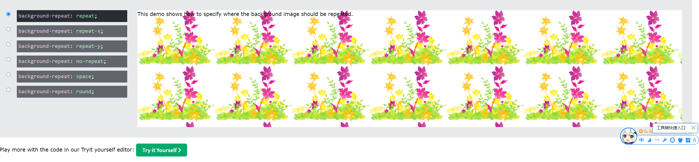
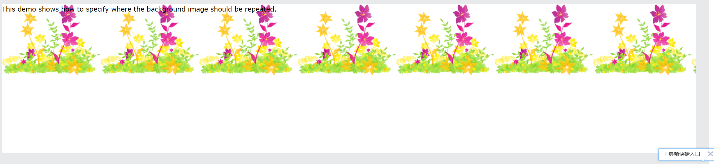
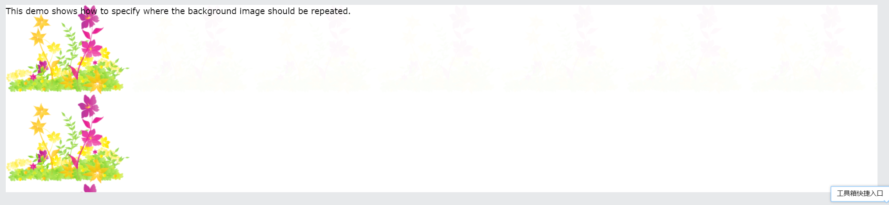
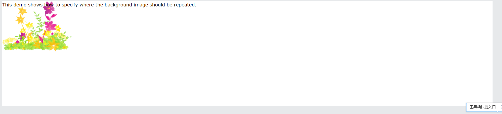
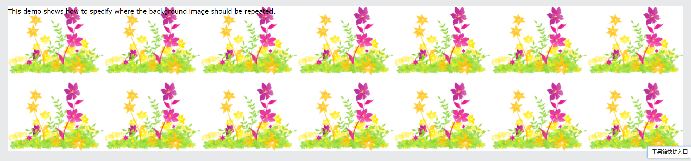
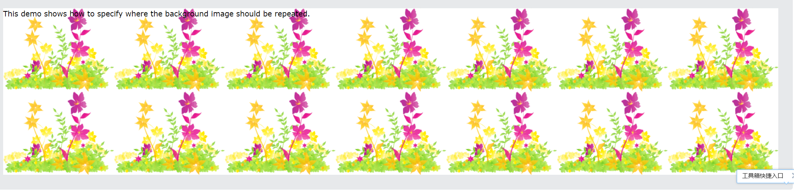

### 插入图片

~~~
<!DOCTYPE html>
<html lang="en">

<head>
    <meta charset="UTF-8">
    <meta name="viewport" content="width=device-width, initial-scale=1.0">
    <meta http-equiv="X-UA-Compatible" content="ie=edge">
    <title>背景图片</title>
    
</head>

<body>
    

</body>

</html>
~~~

图片的状态

~~~
<!DOCTYPE html>
<html lang="en">

<head>
    <meta charset="UTF-8">
    <meta name="viewport" content="width=device-width, initial-scale=1.0">
    <meta http-equiv="X-UA-Compatible" content="ie=edge">
    <title>背景图片平铺</title>
    
</head>

<body>
    

</body>

</html>
~~~

repeat

repeat-x

repeat-y

no-repeat

space

round

### background-size

此时会保持图像的纵横比并将图像缩放成将适合背景定位区域的最大大小。

二倍图

会用这个缩放