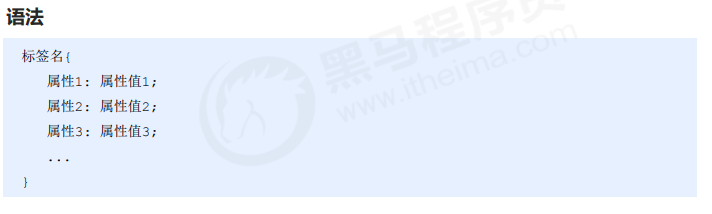
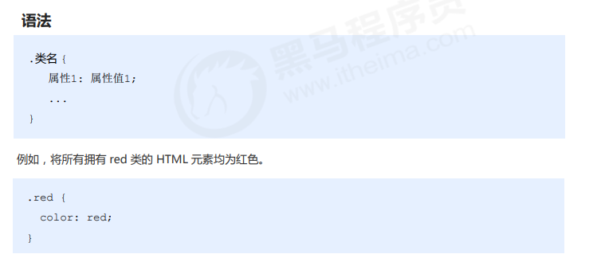
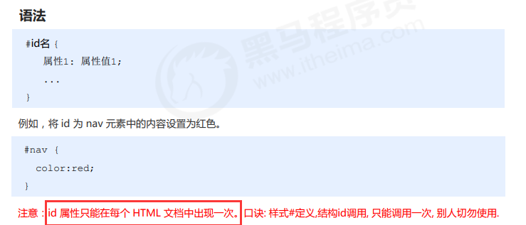
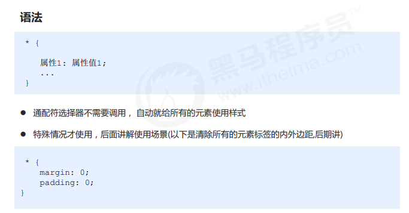

## 初级选择器

### 标签选择器

~~~html
<!DOCTYPE html>
<html lang="en">
<head>
    <meta charset="UTF-8">
    <meta name="viewport" content="width=device-width, initial-scale=1.0">
    <meta http-equiv="X-UA-Compatible" content="ie=edge">
    <title>基础选择器之标签选择器</title>
    
</head>
<body>
    
男生

    
男生

    
男生

    
女生

    
女生

    
女生

</body>
</html>
~~~

### 优缺点

优点 ：标签选择器可以把某一类标签全部选择出来

缺点 ：不能设计差异化样式，只能选择全部的当前标签

###  类选择器 用的最多

~~~html
<!DOCTYPE html>
<html lang="en">
<head>
    <meta charset="UTF-8">
    <meta name="viewport" content="width=device-width, initial-scale=1.0">
    <meta http-equiv="X-UA-Compatible" content="ie=edge">
    <title>基础选择器之类选择器</title>
    
</head>
<body>
    <ul>
        <li class="red">冰雨</li>
        <li class="red">来生缘</li>
        <li>李香兰</li>
        <li class="memeda">生僻字</li>
        <li class="star-sing">江南style</li>
    </ul>
    
我也想变红色

</body>
</html>
~~~

#### 类选择器-多类名

~~~

盖伦

~~~

~~~html
<!DOCTYPE html>
<html lang="en">
<head>
    <meta charset="UTF-8">
    <meta name="viewport" content="width=device-width, initial-scale=1.0">
    <meta http-equiv="X-UA-Compatible" content="ie=edge">
    <title>利用类选择器画三个盒子</title>
    
</head>
<body>
    
红色

    
绿色

    
红色

</body>
</html>
~~~

###  id 选择器

类选择器在修改样式中用的最多，id 选择器一般用于页面**唯一性的元素上**，经常和 JavaScript 搭配使用。

~~~
<!DOCTYPE html>
<html lang="en">
<head>
    <meta charset="UTF-8">
    <meta name="viewport" content="width=device-width, initial-scale=1.0">
    <meta http-equiv="X-UA-Compatible" content="ie=edge">
    <title>基础选择器之id选择器</title>
    
</head>
<body>
    
迈克尔·杰克逊

    
pink老师

</body>
</html>
~~~

### 通配符选择器

~~~
<!DOCTYPE html>
<html lang="en">
<head>
    <meta charset="UTF-8">
    <meta name="viewport" content="width=device-width, initial-scale=1.0">
    <meta http-equiv="X-UA-Compatible" content="ie=edge">
    <title>基础选择器之通配符选择器</title>
    
</head>
<body>
    
我的

    我的
    <ul>
        <li>还是我的</li>
    </ul>
</body>
</html>
~~~

