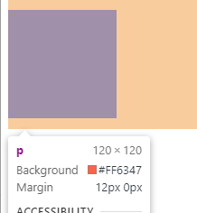
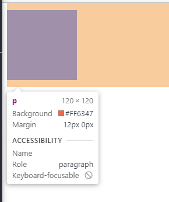

# 移动web开发之rem布局

### rem基础

#### em

是一个相对单位，em是**父元素字体大小**。

~~~html
        div {
            font-size: 12px;
        }

        p {
            width: 10em;
            height: 10em;
            background-color: tomato;

        }
</head>

<body>
    <div>
        <p></p>
    </div>
</body>
~~~



#### rem单位

rem的基准是相对于html元素的字体大小。

比如，根元素（html）设置font-size=12px; 非根元素设置width:1rem; 则换成px表示就是120px。

~~~
<!DOCTYPE html>
<html lang="en">

<head>
    <meta charset="UTF-8">
    <meta http-equiv="X-UA-Compatible" content="IE=edge">
    <meta name="viewport" content="width=div, initial-scale=1.0">
    <title>Document</title>
    <style>
        html {
            font-size: 12px;
        }

        p {
            /* em是相对与父亲来说 */
            width: 10em;
            height: 10em;
            background-color: tomato;

        }
    </style>
</head>

<body>
    <div>
        <p></p>
    </div>
</body>

</html>
~~~




优点

**rem的优点就是可以通过修改html（页面中只有一个html）里面的文字大小来改变页面中元素的大小可以整体控制**

### 媒体查询

#### 什么是媒体查询

媒体查询（Media Query）是CSS3新语法。

+ 使用 @media查询，可以针对不同的媒体类型定义不同的样式
+ @media 可以针对不同的屏幕尺寸设置不同的样式
+ 当你重置浏览器大小的过程中，页面也会根据浏览器的宽度和高度重新渲染页面 
+ 目前针对很多苹果手机、Android手机，平板等设备都用得到多媒体查询

#### 媒体查询语法规范

+ 用 @media开头 注意@符号
+ mediatype  媒体类型
+ 关键字 and  not  only
+ media feature 媒体特性必须有小括号包含

~~~
@media mediatype and|not|only (media feature) {
    CSS-Code;
}
~~~

mediatype 查询类型

​       将不同的终端设备划分成不同的类型，称为媒体类型


关键字

将媒体类型或多个媒体特性连接到一起做为媒体查询的条件。

+ and：可以将多个媒体特性连接到一起，相当于“且”的意思。
+ not：排除某个媒体类型，相当于“非”的意思，可以省略。
+ only：指定某个特定的媒体类型，可以省略。    

~~~html
<!DOCTYPE html>
<html lang="en">

<head>
    <meta charset="UTF-8">
    <meta http-equiv="X-UA-Compatible" content="IE=edge">
    <meta name="viewport" content="width=device-width, initial-scale=1.0">
    <title>Document</title>
</head>
<style>
    /* 这句话的意思就是： 在我们屏幕上
     并且 最大的宽度是 800像素 设置我们想要的样式 */
    /* max-width 小于等于800 变成粉红色 */
    @media screen and (max-width:800px) {
        body {
            background-color: pink;
        }
    }

    @media screen and (max-width: 500px) {
        body {
            background-color: purple;
        }
    }
</style>

<body>

</body>

</html>
~~~

#### 小案例

~~~
<!DOCTYPE html>
<html lang="en">

<head>
    <meta charset="UTF-8">
    <meta http-equiv="X-UA-Compatible" content="IE=edge">
    <meta name="viewport" content="width=device-width, initial-scale=1.0">
    <title>Document</title>
</head>
<style>
    /* 1. 媒体查询一般按照从大到小或者 从小到大的顺序来 */
    /* 2. 小于540px 页面的背景颜色变为蓝色 */
    @media screen and (max-width:539px) {
        boby {
            background-color: blue;
        }
    }

    /* 3. 540 ~ 970 我们的页面颜色改为 绿色 */
    /* @media screen and (min-width: 540px) and (max-width: 969px) {
        body {
            background-color: green;
        }
    } */

    /* 等于以下写法 */
    @media screen and (min-width: 540px) {
        body {
            background-color: green;
        }
    }

    /* 4. 大于等于970 我们页面的颜色改为 红色 */

    @media screen and (min-width: 970px) {
        body {
            background-color: red;
        }
    }

    /* 5. screen 还有 and 必须带上不能省略的 */
    /* 6. 我们的数字后面必须跟单位 970px 这个 px 不能省略的 */
</style>

<body>

</body>

</html>
~~~

媒体查询+rem实现元素动态变化.html

~~~
<!DOCTYPE html>
<html lang="en">

<head>
    <meta charset="UTF-8">
    <meta name="viewport" content="width=device-width, initial-scale=1.0">
    <meta http-equiv="X-UA-Compatible" content="ie=edge">
    <title>Document</title>
    <style>
        * {
            margin: 0;
            padding: 0;
        }
        /* html {
            font-size: 100px;
        } */
        /* 从小到大的顺序 */
        
        @media screen and (min-width: 320px) {
            html {
                font-size: 50px;
            }
        }
        
        @media screen and (min-width: 640px) {
            html {
                font-size: 100px;
            }
        }
        
        .top {
            height: 1rem;
            font-size: .5rem;
            background-color: green;
            color: #fff;
            text-align: center;
            line-height: 1rem;
        }
    </style>
</head>

<body>
    <div class="top">购物车</div>
</body>

</html>
~~~


引入不同CSS的案例

~~~
<!DOCTYPE html>
<html lang="en">

<head>
    <meta charset="UTF-8">
    <meta name="viewport" content="width=device-width, initial-scale=1.0">
    <meta http-equiv="X-UA-Compatible" content="ie=edge">
    <title>Document</title>
    <style>
        /* 当我们屏幕大于等于 640px以上的，我们让div 一行显示2个 */
        /* 当我们屏幕小于640 我们让div一行显示一个 */
        /* 一个建议： 我们媒体查询最好的方法是从小到大 */
        /* 引入资源就是 针对于不同的屏幕尺寸 调用不同的css文件 */
    </style>
    <link rel="stylesheet" href="style320.css" media="screen and (min-width: 320px)">
    <link rel="stylesheet" href="style640.css" media="screen and (min-width: 640px)">
</head>

<body>
    <div>1</div>
    <div>2</div>
</body>

</html>
~~~

#### rem适配方案

~~~
<!DOCTYPE html>
<html lang="en">

<head>
    <meta charset="UTF-8">
    <meta name="viewport" content="width=device-width, initial-scale=1.0">
    <meta http-equiv="X-UA-Compatible" content="ie=edge">
    <title>Document</title>
    <style>
        @media screen and (min-width: 320px) {
            html {
                font-size: 21.33px;
            }
        }
        
        @media screen and (min-width: 750px) {
            html {
                font-size: 50px;
            }
        }
        
        div {
            width: 2rem;
            height: 2rem;
            background-color: pink;
        }
        /* 1. 首先我们选一套标准尺寸 750为准 
        2. 我们用屏幕尺寸 除以 我们划分的份数 得到了 html 里面的文字大小 但是我们知道不同屏幕下得到的文字大小是不一样的 */
        /* 3. 页面元素的rem值 =  页面元素在 750像素的下px值 / html 里面的文字大小 */
    </style>
</head>

<body>
    <div></div>
</body>

</html>
~~~


### less 基础

#### 维护css弊端

CSS 是一门非程序式语言，没有变量、函数、SCOPE（作用域）等概念。

+ CSS 需要书写大量看似没有逻辑的代码，CSS 冗余度是比较高的。
+ 不方便维护及扩展，不利于复用。
+ CSS 没有很好的计算能力
+ 非前端开发工程师来讲，往往会因为缺少 CSS 编写经验而很难写出组织良好且易于维护的 CSS 代码项目。 

#### Less 介绍 

Less（LeanerStyle Sheets 的缩写）是一门 CSS扩展语言，也成为CSS预处理器。

做为 CSS的一种形式的扩展，它并没有减少CSS的功能，而是在现有的CSS语法上，为CSS加入程序式语言的特性。

它在CSS 的语法基础之上，引入了变量，Mixin（混入），运算以及函数等功能，大大简化了 CSS 的编写，并且降低了 CSS的维护成本，就像它的名称所说的那样，Less可以让我们用更少的代码做更多的事情。

Less中文网址：[http://](http://lesscss.cn/)[less](http://lesscss.cn/)[css.cn/](http://lesscss.cn/)

常见的CSS预处理器：Sass、Less、Stylus

一句话：Less是一门 CSS 预处理语言，它扩展了CSS的动态特性。

#### Less安装

①安装nodejs，可选择版本(8.0)，网址：<http://nodejs.cn/download/>

②检查是否安装成功，使用cmd命令（win10是window+r 打开运行输入cmd）  ---输入“node –v”查看版本即可

③基于nodejs在线安装Less，使用cmd命令“npm install -g less”即可

④检查是否安装成功，使用cmd命令“ lessc -v ”查看版本即可

Less 使用之变量

变量是指没有固定的值，可以改变的。因为我们CSS中的一些颜色和数值等经常使用。

```
@变量名:值;
```

+ 必须有@为前缀
+ 不能包含特殊字符
+ 不能以数字开头
+ 大小写敏感

```
@color: pink;
```

Less 编译 vocode Less 插件

Easy LESS 插件用来把less文件编译为css文件

安装完毕插件，重新加载下 vscode。

只要保存一下Less文件，会自动生成CSS文件。


Less 嵌套

```
// 将css改为less
#header .logo {
  width: 300px;
}

#header {
    .logo {
       width: 300px;
    }
}

```

如果遇见 （交集|伪类|伪元素选择器） ，利用&进行连接

```
a:hover{
    color:red;
}
a{
  &:hover{
      color:red;
  }
}
```

~~~
.header {
    width: 200px;
    height: 200px;
    background-color: pink;
    // 1. less嵌套 子元素的样式直接写到父元素里面就好了
    a {
        color: red;
        // 2. 如果有伪类、交集选择器、 伪元素选择器 我们内层选择器的前面需要加&
        &:hover {
            color: blue;
        }
    }
}
.nav {
    .logo {
        color: green;
    }
    &::before {
        content: "";
    }
}
~~~


Less 运算

任何数字、颜色或者变量都可以参与运算。就是Less提供了加（+）、减（-）、乘（*）、除（/）算术运算。

```
/*Less 里面写*/
@witdh: 10px + 5;
div {
    border: @witdh solid red;
}
/*生成的css*/
div {
  border: 15px solid red;
}
/*Less 甚至还可以这样 */
width: (@width + 5) * 2;

```

+ 乘号（*）和除号（/）的写法  
+ 运算符中间左右有个空格隔开 1px + 5
+ 对于两个不同的单位的值之间的运算，运算结果的值取第一个值的单位 
+ 如果两个值之间只有一个值有单位，则运算结果就取该单位

~~~
@baseFont: 50px;
html {
    font-size: @baseFont;
}
@border: 5px + 5;
div {
    width: 200px - 50;
    height: (200px + 50px ) * 2;
    border: @border solid red;
    background-color: #666 - #222;
}
img {
    width: 82rem / @baseFont;
    height: 82rem / @baseFont;
}
// 1. 我们运算符的左右两侧必须敲一个空格隔开
// 2. 两个数参与运算  如果只有一个数有单位，则最后的结果就以这个单位为准
// 3. 两个数参与运算，如果2个数都有单位，而且不一样的单位 最后的结果以第一个单位为准

~~~

