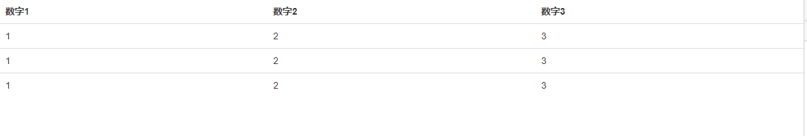

### 表单操作

一个默认操作

~~~
<!DOCTYPE html>
<html lang="en">
<head>
    <meta charset="UTF-8">
    <meta http-equiv="X-UA-Compatible" content="IE=edge">
    <meta name="viewport" content="width=device-width, initial-scale=1.0">
    <title>全局CSS样式-表格</title>
    <link rel="stylesheet" href="./bootstrap-3.4.1-dist/css/bootstrap.min.css">
</head>
<body>
    <table class="">
        <tr>
            <th>数字1</th>
            <th>数字2</th>
            <th>数字3</th>
        </tr>
        <tr>
            <td>1</td>
            <td>2</td>
            <td>3</td>
        </tr>
        <tr>
            <td>1</td>
            <td>2</td>
            <td>3</td>
        </tr>
        <tr>
            <td>1</td>
            <td>2</td>
            <td>3</td>
        </tr>
    </table>

    
</body>
</html>
~~~

加入class="table"

详情请参考

[全局 CSS 样式 · Bootstrap v3 中文文档 | Bootstrap 中文网 (bootcss.com)](https://v3.bootcss.com/css/#tables-example)

### 按钮

~~~
<!DOCTYPE html>
<html lang="en">
<head>
    <meta charset="UTF-8">
    <meta http-equiv="X-UA-Compatible" content="IE=edge">
    <meta name="viewport" content="width=device-width, initial-scale=1.0">
    <title>全局CSS样式-按钮</title>
    <link rel="stylesheet" href="./bootstrap-3.4.1-dist/css/bootstrap.min.css">
</head>
<body>
    <button class="btn btn-success btn-lg">成功</button>

    <button class="btn btn-warning btn-xs">警告</button>
</body>
</html>
~~~

