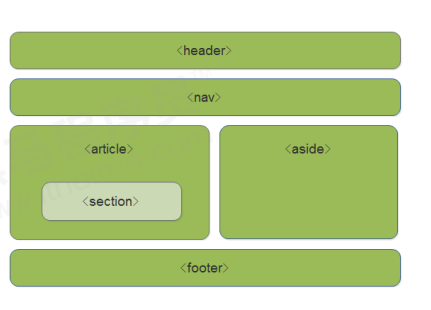
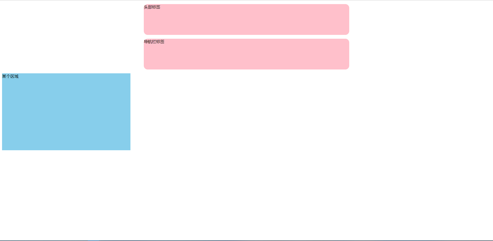
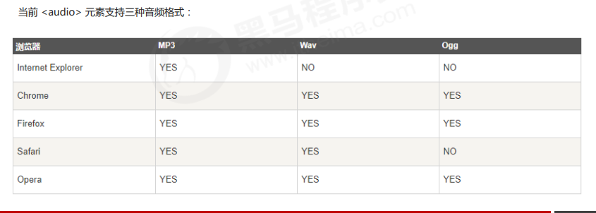
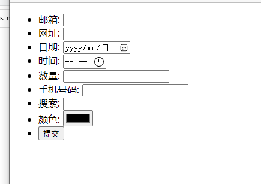
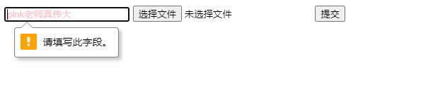

### HTML5 语义化标签

header 头部标签

nav导航标签

article内容标签

section 定义文档某区域

aside 侧边栏标签

footer 尾部标签

#### 优点与使用

搜索引擎会更方便找的内容并且定位

标签可以使用多次

在 IE9 中，需要把这些元素转换为块级元素

~~~

</head>
<body>
    <header>头部标签</header>
    <nav>导航栏标签</nav>
    <section>某个区域</section>
</body>
~~~

##  HTML5 多媒体标签

音频 audio

视频 video

#### 视频 video

使用格式尽量为mp4格式

主流浏览器都支持

##### api调用

~~~html
<html lang="en">
<head>
    <meta charset="UTF-8">
    <meta name="viewport" content="width=device-width, initial-scale=1.0">
    <meta http-equiv="X-UA-Compatible" content="ie=edge">
    <title>HTML5新增视频标签</title>
    
</head>
<body>
    <video src="media/mi.mp4" autoplay="autoplay" muted="muted"  loop="loop" poster="media/mi9.jpg"></video>
</body>
</html>
~~~

| 属性         | 值                  | 功能描述                                             |
| ------------ | ------------------- | ---------------------------------------------------- |
| **controls** | controls            | 是否显示播放控件                                     |
| **autoplay** | autoplay            | 设置是否打开浏览器后自动播放（谷歌浏览器要单独处理） |
| **width**    | Pilex（像素）       | 设置播放器的宽度                                     |
| **height**   | Pilex（像素）       | 设置播放器的高度                                     |
| **loop**     | loop                | 设置视频是否循环播放（即播放完后继续重新播放）       |
| preload      | auto加载 none不加载 | 设置是否等加载完再播放                               |
| **src**      | url                 | 设置要播放视频的url地址                              |
| **poster**   | imgurl              | 设置播放器初始默认显示图片                           |
| autobuffer   | autobuffer          | 设置为浏览器缓冲方式，不设置autoply才有效            |
| muted        | muted               | 静音播放                                             |

#### 音频 audio

最好使用map3

**谷歌浏览器把音频和视频自动播放禁止了**

#### api

| 属性         | 值       | 功能描述                                             |
| ------------ | -------- | ---------------------------------------------------- |
| **controls** | controls | 是否显示播放控件                                     |
| **autoplay** | autoplay | 设置是否打开浏览器后自动播放（谷歌浏览器要单独处理） |
| **loop**     | loop     | 循环播放                                             |
| **scr**      | url      | 播放地址                                             |

~~~
<!DOCTYPE html>
<html lang="en">
<head>
    <meta charset="UTF-8">
    <meta name="viewport" content="width=device-width, initial-scale=1.0">
    <meta http-equiv="X-UA-Compatible" content="ie=edge">
    <title>HTML5新增音频标签</title>
</head>
<body>
    <audio src="media/music.mp3" autoplay="autoplay" controls="controls"></audio>
</body>
</html>
~~~

### HTML5input表单

| 属                | 描述                    |
| ----------------- | ----------------------- |
| type="email"      | 用户输入必须是email类型 |
| type="url"        |                         |
| type="data"       |                         |
| type="time"       |                         |
| type="month"      |                         |
| type="week"       | 用户输入必须是周类型    |
| **type="search"** |                         |
| **type="tel"**    | 手机号码                |
| type="color"      | 颜色表单                |
| **type="number"** | 数值                    |
|                   |                         |
|                   |                         |

~~~html
<!DOCTYPE html>
<html lang="en">

<head>
    <meta charset="UTF-8">
    <meta name="viewport" content="width=device-width, initial-scale=1.0">
    <meta http-equiv="X-UA-Compatible" content="ie=edge">
    <title>Document</title>
</head>

<body>
    <!-- 我们验证的时候必须添加form表单域 -->
    <form action="">
        <ul>
            <li>邮箱: <input type="email" /></li>
            <li>网址: <input type="url" /></li>
            <li>日期: <input type="date" /></li>
            <li>时间: <input type="time" /></li>
            <li>数量: <input type="number" /></li>
            <li>手机号码: <input type="tel" /></li>
            <li>搜索: <input type="search" /></li>
            <li>颜色: <input type="color" /></li>
            <!-- 当我们点击提交按钮就可以验证表单了 -->
            <li> <input type="submit" value="提交"></li>
        </ul>
    </form>
</body>

</html>
~~~

手机显示会比电脑显示好看

| 属性            | 值       | 功能描述                                             |
| --------------- | -------- | ---------------------------------------------------- |
| **required**    | required | 表单不能为空比                                       |
| **placeholder** | 提示文本 | 设置是否打开浏览器后自动播放（谷歌浏览器要单独处理） |
| autofocus       | off/on   | 当用户在字段开始输入时候看有没有搜素记录 默认打开    |
| multiple        | multiple | 多个文件可以提交                                     |

~~~html
<!DOCTYPE html>
<html lang="en">
<head>
    <meta charset="UTF-8">
    <meta name="viewport" content="width=device-width, initial-scale=1.0">
    <meta http-equiv="X-UA-Compatible" content="ie=edge">
    <title>HTML5新增表单属性</title>
    
</head>
<body>
    <form action="">
            <input type="search" name="sear" id="" required="required" placeholder="pink老师真伟大" autofocus="autofocus" autocomplete="off">
            <input type="file" name="" id="" multiple="multiple">
            <input type="submit" value="提交">
    </form>
  
</body>
</html>
~~~

