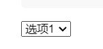
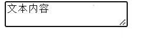

#### 普通标签

```html
<!DOCTYPE> 文档类型声明标签
<meta charset = "UTF-8"> 字符集
<h1> - <h6> 双标签 标题标签	作为标题使用  该文字重要性
<p> 双标签 段落标签
<br/> 换行
<hr/> 下划线
<strong> 加粗 <b>
<em> 倾斜 <i>
<del> 删除线 <s>
<ins> 下划线  <u>
<div>  布局  一行支持一个 大盒子  块标签
<span> 布局 一行多个 小盒子  行标签
```

#### 图像标签

```html

	src  文件路径
	alt  图片替换文本（图片不可显示
	title  提示文本，鼠标放到图片上面提示文本
	width 宽度  height  高度
	border 边框宽度
图像路径  同级  无符号；下一级  /；上一级  ../；
```

#### 超链接标签

```html
<a href="跳转目标" target="打开方式">文本</href>
	target：_self 当前窗口打开；_blank 新窗口打开
	空链接：#
	下载链接：文件，压缩包
	网页元素链接：音频，视频，等
	锚点链接：#xxx；id=“xxx”
```

#### 注释标签

```html
<!--xxx-->
```

#### 符号

```html
&nbsp; 空格；< : &lt;	> :&gt;
```

#### 表格标签:显示数据

##### 表格基本语法

```html
<table>
    <tr>
        <td>表格内容</td>
        <td>表格内容</td>
        <td>表格内容</td>
    </tr>
</table>
```

| 表格内容 | 表格内容 | 表格内容 |
| -------- | -------- | -------- |
|          |          |          |

##### 表格单元格标签

```html
<table>
    <tr><th>姓名</th></tr>
    <tr>
        <td>表格内容</td>
        <td>表格内容</td>
        <td>表格内容</td>
    </tr>
</table>
```

| 姓名     |          |          |
| -------- | -------- | -------- |
| 表格内容 | 表格内容 | 表格内容 |

##### 表格属性

| 属性名      | 属性值              | 描述                                    |
| ----------- | ------------------- | --------------------------------------- |
| align       | left、center、right | 表格相对对齐方式                        |
| border      | 1或””               | 表格边框存在，””表示没有边框            |
| cellpadding | 像素值              | 单元边界与内容间距，默认1像素、、内边距 |
| cellspacing | 像素值              | 单元格之间的空白、、外边距              |
| width       | 像素值或百分比      | 表格宽度                                |

###### 案例

```html
<table align="center">
    <tr>
        <th>排名</th>
        <th>关键词</th>
        <th>相关链接</th>
    </tr>
    <tr>    
        <td>1</td>
        <td>Github</td>
        <td>
            <a href="https://github.com">相关</a>
        </td>
    </tr>
    <tr>    
        <td>2</td>
        <td>Blog</td>
        <td>
            <a href="https://handsomelv.top">相关</a>
        </td>
    </tr>
</table>
```

| 排名 | 关键词 | 相关链接                        |
| ---- | ------ | ------------------------------- |
| 1    | Github | [相关](https://github.com/)     |
| 2    | Blog   | [相关](https://handsomelv.top/) |

##### 表格结构标签

```html
<thead>表格头部标签</thead>
<tbody>表格主体标签</tbody>
<table align="center" border=1>
        <thead>
            <tr>
                <th>排名</th>
                <th>关键词</th>
                <th>相关链接</th>
            </tr>
        </thead>

        <tbody>
            <tr>
                <td>1</td>
                <td>Github</td>
                <td>
                    <a href="https://github.com">相关</a>
                </td>
            </tr>
            <tr>
                <td>2</td>
                <td>Blog</td>
                <td>
                    <a href="https://handsomelv.top">相关</a>
                </td>
            </tr>
        </tbody>
    </table>
```

##### 合并单元格

> 目标单元格：（写合并代码）
>
> - 跨行：最上侧单元格为目标单元格; colspan
> - 跨列：最左侧单元格为目标单元格; rowspan

#### 列表标签：布局

##### 无序列表：`<ul>;<li>`

```html
<ul>
    <li>列表项</li>
</ul>
```

> ```
> <ul>`里只能嵌套`<li>
> ```
>
> `<li>`相当于一个容器，可以容纳所有元素

##### 有序列表：`<ol>;<li>`

##### 自定义列表

```html
<dl>
    <dt>名称</dt>
    <dd>名称描述</dd>
</dl>
```

#### 表单标签：收集信息

> 表单域，表单元素，提示信息

##### 表单域

`<form></form>`用于定义表单域，实现信息的收集和传递

```html
<form action="url" method="提交方式" name="表单域姓名">
    各种表单元素控件
</form>
```

##### 表单元素

###### input 输入表单元素

```html
<input type="" >
```

> ```
> type:button;checkbox;file;hidden;image;text;password;radio 单选;reset 重置;subit 提交;
> ```
>
> `name:`定义`input`元素名称；`value:`规定`input`元素的值；`check:`check,是否选中；`maxlength:`正整数，输入字符最大长度

###### label 标签

`<label>`用于绑定表单元素，点击`<label>`自动对焦到对应的表单元素

```html
<label for="sex">男</label>
<input type="radio" name="sex" id="sex"/>
```

###### select标签

`<select>`下拉列表

```html
<select>
    <option>选项1</option>
    <option>选项2</option>
</select>
```



###### textarea文本域

`<textarea>`定义多行文本输入控件

```html
<textarea>文本内容</textarea>
```

