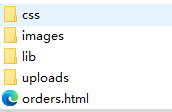
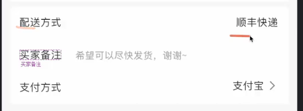

### 文件夹结构

lib存储库文件类容

### section
HTML <section>元素表示一个包含在 HTML 文档中的独立部分，它没有更具体的语义元素来表示，一般来说会有包含一个标题。

~~~
<section>
  <h1>Heading</h1>
  
Bunch of awesome content

</section>
~~~
### 出现这方式

一般用行来排列
