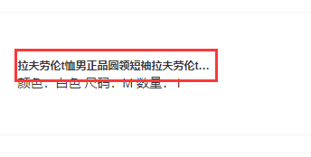
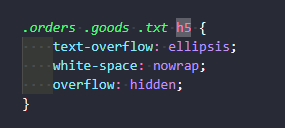
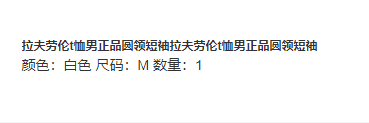
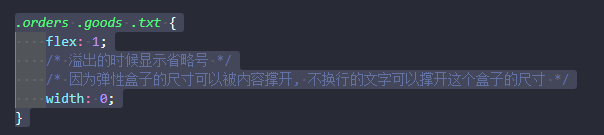
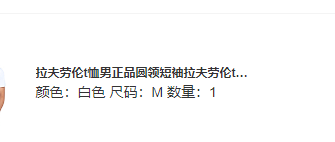
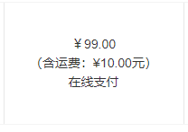
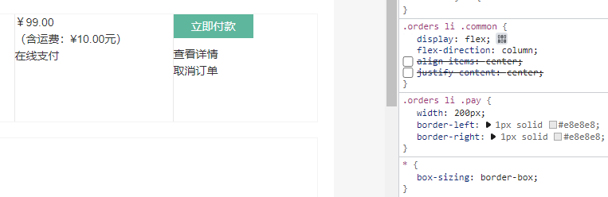
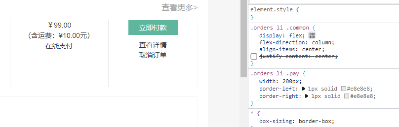
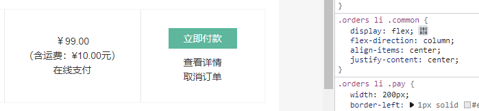

### 省略号的形成 并不换行

如果同时有不换行 以及隐藏 

他会显示再

这时候把父级txt加上

### flex这种布局样式

~~~
    flex-direction: column
~~~

align-items 设置侧轴上的子元素排列方式

应为主轴为竖向

侧轴为横向

~~~

    flex-direction: column;
    align-items: center;

~~~

~~~
    flex-direction: column;
    align-items: center;
    justify-content: center;
~~~

