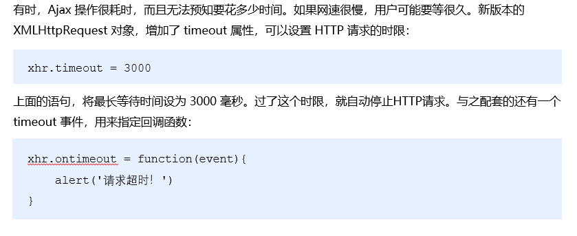

### 旧版XMLHttpRequest的缺点

①只支持文本数据的传输，无法用来读取和上传文件

②传送和接收数据时，没有进度信息，只能提示有没有完成

### XMLHttpRequestLevel2的新功能

①可以设置 HTTP 请求的时限

②可以使用 FormData 对象管理表单数据

③可以上传文件

④可以获得数据传输的进度信息

### **设置****HTTP****请求时限**

### FormData对象管理表单数据

Ajax 操作往往用来提交表单数据。为了方便表单处理，HTML5 新增了一个 FormData 对象，可以模拟表单操作：

~~~
    // 1. 创建 FormData 实例
    var fd = new FormData()
    // 2. 调用 append 函数，向 fd 中追加数据
    fd.append('uname', 'zs')
    fd.append('upwd', '123456')

    var xhr = new XMLHttpRequest()
    xhr.open('POST', 'http://www.liulongbin.top:3006/api/formdata')
    xhr.send(fd)

    xhr.onreadystatechange = function () {
      if (xhr.readyState === 4 && xhr.status === 200) {
        console.log(JSON.parse(xhr.responseText))
      }
    }
~~~

~~~
<!DOCTYPE html>
<html lang="en">

<head>
  <meta charset="UTF-8">
  <meta name="viewport" content="width=device-width, initial-scale=1.0">
  <meta http-equiv="X-UA-Compatible" content="ie=edge">
  <title>Document</title>
</head>

<body>

  <form id="form1">
    <input type="text" name="uname" autocomplete="off" />
    <input type="password" name="upwd" />
    <button type="submit">提交</button>
  </form>

  

</body>

</html>
~~~

### 上传文件进度条的核心操作

### XMLHttpRequest.upload

| `onloadstart` | 获取开始                         |
| ------------- | -------------------------------- |
| `onprogress`  | 数据传输进行中                   |
| `onabort`     | 获取操作终止                     |
| `onerror`     | 获取失败                         |
| `onload`      | 获取成功                         |
| `ontimeout`   | 获取操作在用户规定的时间内未完成 |
| `onloadend`   | 获取完成（不论成功与否）         |