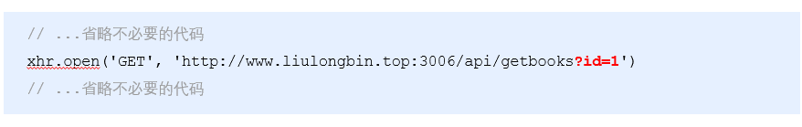

### **使用xhr发起GET请求**

①创建 xhr 对象

②调用 xhr.open() 函数

③调用 xhr.send() 函数

④监听 xhr.onreadystatechange 事件

~~~
// 1. 创建 XHR 对象
var xhr = new XMLHttpRequest()
// 2. 调用 open 函数，指定 请求方式 与 URL地址
xhr.open('GET', 'http://www.liulongbin.top:3006/api/getbooks')
// 3. 调用 send 函数，发起 Ajax 请求
xhr.send()
// 4. 监听 onreadystatechange 事件
xhr.onreadystatechange = function() {
    // 4.1 监听 xhr 对象的请求状态 readyState ；与服务器响应的状态 status
    if (xhr.readyState === 4 && xhr.status === 200) {
        // 4.2 打印服务器响应回来的数据
        console.log(xhr.responseText)
    }
}

~~~

#### **readyState**属性

XMLHttpRequest 对象的 readyState 属性，用来表示**当前** **Ajax** **请求所处的状态**。每个 Ajax 请求必然处于以下状态中的一个：

| **值** | **状态**         | **描述**                                             |
| ------ | ---------------- | ---------------------------------------------------- |
| 0      | UNSENT           | XMLHttpRequest  对象已被创建，但尚未调用  open方法。 |
| 1      | OPENED           | open() 方法已经被调用。                              |
| 2      | HEADERS_RECEIVED | send() 方法已经被调用，响应头也已经被接收。          |
| 3      | LOADING          | 数据接收中，此时  response  属性中已经包含部分数据。 |
| 4      | DONE             | Ajax  请求完成，这意味着数据传输已经彻底完成或失败。 |

#### 带参数的

#### **查询字符串**

定义：查询字符串（URL 参数）是指在 URL 的末尾加上用于向服务器发送信息的字符串（变量）。

格式：将英文的 **?** 放在URL 的末尾，然后再加上 **参数＝值** ，想加上多个参数的话，使用 **&** 符号进行分隔。以这个形式，可以将想要发送给服务器的数据添加到 URL 中。

~~~
// 不带参数的 URL 地址
http://www.liulongbin.top:3006/api/getbooks
// 带一个参数的 URL 地址
http://www.liulongbin.top:3006/api/getbooks?id=1
// 带两个参数的 URL 地址
http://www.liulongbin.top:3006/api/getbooks?id=1&bookname=西游记

~~~

#### 不同写法

~~~
$.get('url', {name: 'zs', age: 20}, function() {})
// 等价于
$.get('url?name=zs&age=20', function() {})

$.ajax({ method: 'GET', url: 'url', data: {name: 'zs', age: 20}, success: function() {} })
// 等价于
$.ajax({ method: 'GET', url: 'url?name=zs&age=20', success: function() {} })

~~~

### URL编码

URL 地址中，只允许出现英文相关的字母、标点符号、数字，因此，在 URL 地址中不允许出现中文字符。

如果 URL 中需要包含中文这样的字符，则必须对中文字符进行**编码**（转义）。

**URL****编码的原则**：使用安全的字符（没有特殊用途或者特殊意义的可打印字符）去表示那些不安全的字符。

URL编码原则的通俗理解：使用英文字符去表示非英文字符。

~~~
http://www.liulongbin.top:3006/api/getbooks?id=1&bookname=西游记
// 经过 URL 编码之后，URL地址变成了如下格式：
http://www.liulongbin.top:3006/api/getbooks?id=1&bookname=%E8%A5%BF%E6%B8%B8%E8%AE%B0

~~~

JS写法

~~~
encodeURI('黑马程序员')
// 输出字符串  %E9%BB%91%E9%A9%AC%E7%A8%8B%E5%BA%8F%E5%91%98
decodeURI('%E9%BB%91%E9%A9%AC')
// 输出字符串  黑马

~~~

### 使用xhr发起POST请求

步骤：

①创建 xhr 对象

②调用 xhr.open() 函数

③**设置** **Content-Type** **属性**（固定写法）

④调用 xhr.send() 函数，**同时指定要发送的数据**

⑤监听 xhr.onreadystatechange 事件