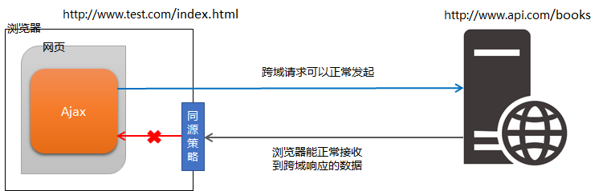

### 什么是同源

如果两个页面的协议，域名和端口都相同，则两个页面具有**相同的源**

例如，下表给出了相对于 http://www.test.com/index.html 页面的同源检测：

| **URL**                            | **是否同源** | **原因**                                  |
| ---------------------------------- | ------------ | ----------------------------------------- |
| http://www.test.com/other.html     | 是           | 同源（协议、域名、端口相同）              |
| https://www.test.com/about.html    | 否           | 协议不同（http  与  https）               |
| http://blog.test.com/movie.html    | 否           | 域名不同（www.test.com 与 blog.test.com） |
| http://www.test.com:7001/home.html | 否           | 端口不同（默认的  80 端口与  7001 端口）  |
| http://www.test.com:80/main.html   | 是           | 同源（协议、域名、端口相同）              |

### 什么是同源策略

**同源策略**（英文全称 Same origin policy）是浏览器提供的一个安全功能。

MDN 官方给定的概念：同源策略限制了从同一个源加载的文档或脚本如何与来自另一个源的资源进行交互。这是一个用于隔离潜在恶意文件的重要安全机制。

通俗的理解：浏览器规定，A 网站的 JavaScript，不允许和非同源的网站 C 之间，进行资源的交互，例如：

①无法读取非同源网页的 Cookie、LocalStorage 和 IndexedDB

②无法接触非同源网页的 DOM

③无法向非同源地址发送 Ajax 请求

### 什么是跨域

**同源**指的是两个 URL 的协议、域名、端口一致，反之，则是**跨域**。

出现跨域的根本原因：**浏览器的同源策略**不允许非同源的 URL 之间进行资源的交互。

网页：http://www.test.com/index.html

接口：http://www.api.com/userlist

**浏览器对跨域请求的拦截**

注意：浏览器允许发起跨域请求，但是，跨域请求回来的数据，会被浏览器拦截，无法被页面获取到！

### **如何实现跨域数据请求**

现如今，实现跨域数据请求，最主要的两种解决方案，分别是 JSONP 和 CORS。

JSONP：出现的早，兼容性好（兼容低版本IE）。是前端程序员为了解决跨域问题，被迫想出来的一种临时解决方案。缺点是只支持 GET 请求，不支持 POST 请求。

CORS：出现的较晚，它是 W3C 标准，属于跨域 Ajax 请求的根本解决方案。支持 GET 和 POST 请求。缺点是不兼容某些低版本的浏览器。