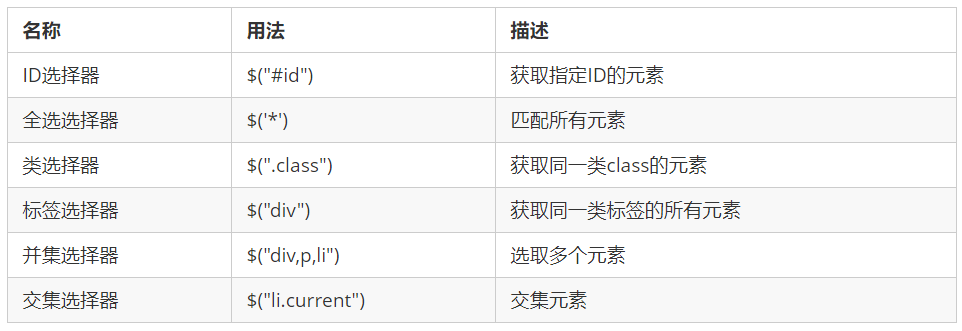
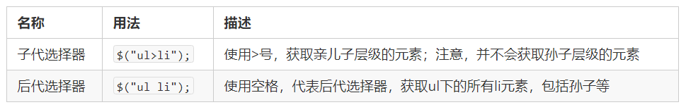
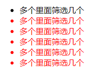
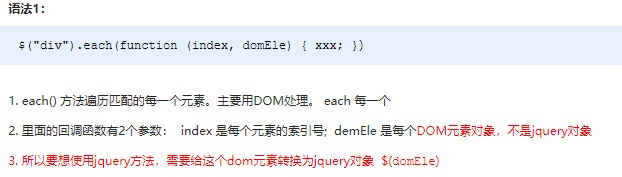

### 安装

咱们先去下包:官网地址是这个:

https://jquery.com/

~~~html
    <script src="https://cdnjs.cloudflare.com/ajax/libs/jquery/3.6.0/jquery.js"
        integrity="sha512-n/4gHW3atM3QqRcbCn6ewmpxcLAHGaDjpEBu4xZd47N0W2oQ+6q7oc3PXstrJYXcbNU1OHdQ1T7pAP+gi5Yu8g=="
        crossorigin="anonymous" referrerpolicy="no-referrer"></script>
    <script>
        console.log($)
        $('body').css('backgroundColor', 'yellowgreen')
    </script>

~~~

###  jQuery中的顶级对象$

1.  \$是 jQuery 的别称，在代码中可以使用 jQuery 代替，但一般为了方便，通常都直接使用 $ 。
2.  \$是jQuery的顶级对象，相当于原生JavaScript中的 window。把元素利用$包装成jQuery对象，就可以调用jQuery 的方法。

###  jQuery 对象和 DOM 对象转换

​	DOM 对象与 jQuery 对象之间是可以相互转换的。因为原生js 比 jQuery 更大，原生的一些属性和方法 jQuery没有给我们封装. 要想使用这些属性和方法需要把jQuery对象转换为DOM对象才能使用。

```javascript
// 1.DOM对象转换成jQuery对象，方法只有一种
var box = document.getElementById('box');  // 获取DOM对象
var jQueryObject = $(box);  // 把DOM对象转换为 jQuery 对象

// 2.jQuery 对象转换为 DOM 对象有两种方法：
//   2.1 jQuery对象[索引值]
var domObject1 = $('div')[0]

//   2.2 jQuery对象.get(索引值)
var domObject2 = $('div').get(0)
 
```

总结：实际开发比较常用的是把DOM对象转换为jQuery对象，这样能够调用功能更加强大的jQuery中的方法。

###  jQuery选择器

```javascript
// 基本用法
$('选择器')

```



```javascript
// 标签选择器
$('p').css('background', 'red');
```

再来测试一下类选择器，页面上哪个元素有类名呀？

```javascript
// 类选择器
$('.p').css('background', 'blue');
```

> 大伙id选择器的符号还记得吗？

```javascript
// id 选择器
$('#p').css('background', 'green');
```



```javascript
// 后代选择器
$('body p').css('color', 'white');
```

###  jQuery筛选选择器

筛选选择器，顾名思义就是在所有的选项中选择满足条件的进行筛选选择。常见如下 :


**案例代码**

```js
<body>
    <ul>
        <li>多个里面筛选几个</li>
        <li>多个里面筛选几个</li>
        <li>多个里面筛选几个</li>
        <li>多个里面筛选几个</li>
        <li>多个里面筛选几个</li>
        <li>多个里面筛选几个</li>
    </ul>
    <ol>
        <li>多个里面筛选几个</li>
        <li>多个里面筛选几个</li>
        <li>多个里面筛选几个</li>
        <li>多个里面筛选几个</li>
        <li>多个里面筛选几个</li>
        <li>多个里面筛选几个</li>
    </ol>
    <script>
        $(function() {
            $("ul li:first").css("color", "red");
            $("ul li:eq(2)").css("color", "blue");
            $("ol li:odd").css("color", "skyblue");
            $("ol li:even").css("color", "pink");
        })
    </script>
</body>
```

另:  jQuery中还有一些筛选方法，类似DOM中的通过一个节点找另外一个节点，父、子、兄以外有所加强。


### jQuery 里面的排他思想

~~~
// 想要多选一的效果，排他思想：当前元素设置样式，其余的兄弟元素清除样式。
$(this).css(“color”,”red”);
$(this).siblings(). css(“color”,””);
~~~

~~~html
<body>

    <body>
        <ul>
            <li>多个里面筛选几个</li>
            <li>多个里面筛选几个</li>
            <li>多个里面筛选几个</li>
            <li>多个里面筛选几个</li>
            <li>多个里面筛选几个</li>
            <li>多个里面筛选几个</li>
        </ul>
        <script src="https://cdnjs.cloudflare.com/ajax/libs/jquery/3.6.0/jquery.js"
            integrity="sha512-n/4gHW3atM3QqRcbCn6ewmpxcLAHGaDjpEBu4xZd47N0W2oQ+6q7oc3PXstrJYXcbNU1OHdQ1T7pAP+gi5Yu8g=="
            crossorigin="anonymous" referrerpolicy="no-referrer"></script>
        <script>
            $(function () {
                //排他思想：当前元素设置样式，其余的兄弟元素清除样式。
                //除了第一个li都变颜色
                $("ul li:first").siblings().css("color", "red");

            })
        </script>


    </body>
~~~




### jQuery 操作 css 方法

```javascript
// 1.参数只写属性名，则是返回属性值
var strColor = $(this).css('color');

// 2.  参数是属性名，属性值，逗号分隔，是设置一组样式，属性必须加引号，值如果是数字可以不用跟单位和引号
$(this).css(''color'', ''red'');

// 3.  参数可以是对象形式，方便设置多组样式。属性名和属性值用冒号隔开， 属性可以不用加引号
$(this).css({ "color":"white","font-size":"20px"});

```

### jQuery 操作设置类样式方法

```javascript
// 1.添加类
$("div").addClass("current");

// 2.删除类
$("div").removeClass("current");

// 3.切换类
$("div").toggleClass("current");

```

​	注意：

1. 设置类样式方法比较适合样式多时操作，可以弥补css()的不足。
2. 原生 JS 中 className 会覆盖元素原先里面的类名，jQuery 里面类操作只是对指定类进行操作，不影响原先的类名。


### jQuery 元素操作——遍历元素

​	jQuery 隐式迭代是对同一类元素做了同样的操作。 如果想要给同一类元素做不同操作，就需要用到遍历。

**语法1**



​	注意：此方法用于遍历 jQuery 对象中的每一项，回调函数中元素为 DOM 对象，想要使用 jQuery 方法需要转换。

**语法2**


​	注意：此方法用于遍历 jQuery 对象中的每一项，回调函数中元素为 DOM 对象，想要使用 jQuery 方法需要转换。

**演示代码**

~~~
<body>
    <div>1</div>
    <div>2</div>
    <div>3</div>
    <script>
        $(function() {
            // 如果针对于同一类元素做不同操作，需要用到遍历元素（类似for，但是比for强大）
            var sum = 0;
            var arr = ["red", "green", "blue"];
            // 1. each() 方法遍历元素 
            $("div").each(function(i, domEle) {
                // 回调函数第一个参数一定是索引号  可以自己指定索引号号名称
                // console.log(i);
                // 回调函数第二个参数一定是 dom 元素对象，也是自己命名
                // console.log(domEle);  // 使用jQuery方法需要转换 $(domEle)
                $(domEle).css("color", arr[i]);
                sum += parseInt($(domEle).text());
            })
            console.log(sum);
            // 2. $.each() 方法遍历元素 主要用于遍历数据，处理数据
            // $.each($("div"), function(i, ele) {
            //     console.log(i);
            //     console.log(ele);
            // });
            // $.each(arr, function(i, ele) {
            //     console.log(i);
            //     console.log(ele);
            // })
            $.each({
                name: "andy",
                age: 18
            }, function(i, ele) {
                console.log(i); // 输出的是 name age 属性名
                console.log(ele); // 输出的是 andy  18 属性值
            })
        })
    </script>
</body>
~~~

### jQuery 元素操作——创建、添加、删除

​	jQuery方法操作元素的创建、添加、删除方法很多，则重点使用部分，如下：

**语法总和**


​										可以事件委派操作。事件委派定义是，把原来加给子元素身上的事件绑定在父元素身上，就是把事件委派给父元素。


注意：以上只是元素的创建、添加、删除方法的常用方法，其他方法请参详API。

案例代码

~~~
<body>
    <ul>
        <li>原先的li</li>
    </ul>
    <div class="test">我是原先的div</div>
    <script>
        $(function() {
            // 1. 创建元素
            var li = $("<li>我是后来创建的li</li>");
      
            // 2. 添加元素
            // 	2.1 内部添加
            // $("ul").append(li);  内部添加并且放到内容的最后面 
            $("ul").prepend(li); // 内部添加并且放到内容的最前面
            //  2.2 外部添加
            var div = $("<div>我是后妈生的</div>");
            // $(".test").after(div);
            $(".test").before(div);
      
            // 3. 删除元素
            // $("ul").remove(); 可以删除匹配的元素 自杀
            // $("ul").empty(); // 可以删除匹配的元素里面的子节点 孩子
            $("ul").html(""); // 可以删除匹配的元素里面的子节点 孩子
        })
    </script>
</body>
~~~


#### 链式编程

~~~
// 链式编程是为了节省代码量，看起来更优雅。
$(this).css('color', 'red').sibling().css('color', ''); 
~~~

#### 隐式迭代

**伪数组** 是一个 Object，而真实的数组是一个 Array，具体的来说：伪数组是一个对象、具有length属性、按照索引方式存储数据、不具有数组的push，pop等方法


遍历内部 DOM 元素（伪数组形式存储）的过程就叫做**隐式迭代**。

简单理解：给匹配到的所有元素进行循环遍历，执行相应的方法，而不用我们再进行循环，简化我们的操作，方便我们调用。

~~~
$('div').hide();  // 页面中所有的div全部隐藏，不用循环操作
~~~


