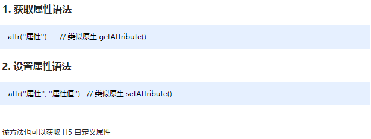

##  jQuery 属性操作

​	注意：prop() 除了普通属性操作，更适合操作表单属性：disabled / checked / selected 等。

### 元素固有属性值 prop()

所谓元素固有属性就是元素本身自带的属性，比如 <a> 元素里面的 href ，比如 <input> 元素里面的 type。 

**语法**

​	注意：prop() 除了普通属性操作，更适合操作表单属性：disabled / checked / selected 等。

### 元素自定义属性值 attr()

​	用户自己给元素添加的属性，我们称为自定义属性。 比如给 div 添加 index =“1”。 

**语法**

​	注意：attr() 除了普通属性操作，更适合操作自定义属性。（该方法也可以获取 H5 自定义属性）

### 数据缓存 data()（临时加载文件使用）

​	data() 方法可以在指定的元素上存取数据，并不会修改 DOM 元素结构。一旦页面刷新，之前存放的数据都将被移除。 

**语法**

​	注意：同时，还可以读取 HTML5 自定义属性  data-index ，得到的是数字型。

~~~
<body>
    <a href="http://www.itcast.cn" title="都挺好">都挺好</a>
    <input type="checkbox" name="" id="" checked>
    
我是div

    123
    
</body>
~~~

