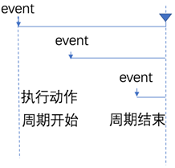

**什么是节流**

**节流策略**（throttle），顾名思义，可以减少一段时间内事件的触发频率。

比如说就是搜索

**4.2** **节流的应用场景**

①鼠标连续不断地触发某事件（如点击），只在单位时间内只触发一次；

②懒加载时要监听计算滚动条的位置，但不必每次滑动都触发，可以降低计算的频率，而不必去浪费 CPU 资源；

### **节流阀****的概念**

高铁卫生间是否被占用，由红绿灯控制，红灯表示被占用，绿灯表示可使用。

假设每个人上卫生间都需要花费5分钟，则五分钟之内，被占用的卫生间无法被其他人使用。

上一个人使用完毕后，需要将红灯**重置**为绿灯，表示下一个人可以使用卫生间。

下一个人在上卫生间之前，需要**先判断控制灯**是否为绿色，来知晓能否上卫生间。

节流阀为空，表示可以执行下次操作；不为空，表示不能执行下次操作。

当前操作执行完，必须将节流阀**重置**为空，表示可以执行下次操作了。

每次执行操作前，必须**先判断节流阀是否为空**。

**总结防抖和节流的区别**

l防抖：如果事件被频繁触发，防抖能保证只有最有一次触发生效！前面 N 多次的触发都会被忽略！

l节流：如果事件被频繁触发，节流能够减少事件触发的频率，因此，节流是有选择性地执行一部分事件！