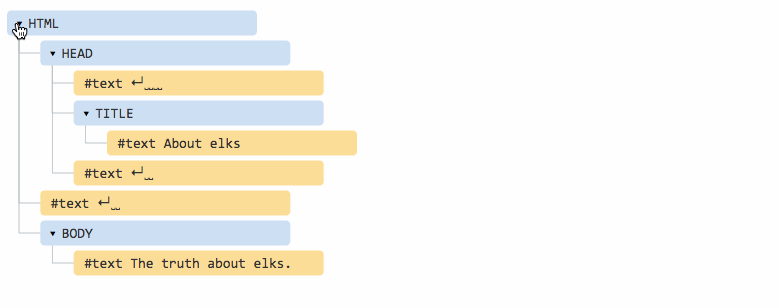
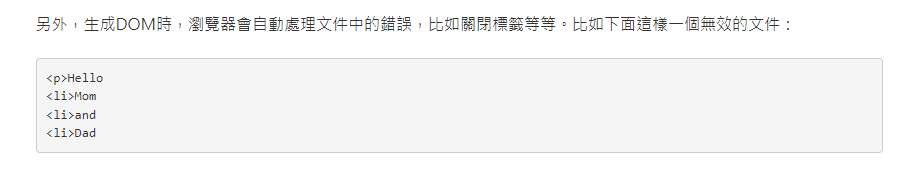
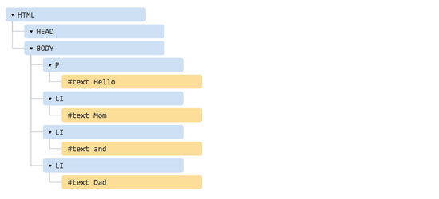

### 什么是DOM

DOM（Document Object Model——文档对象模型）是用来呈现以及与任意 HTML 或 XML文档交互的API

白话文：DOM是浏览器提供的一套专门用来 操作网页内容 的功能 

DOM作用

 开发网页内容特效和实现用户交互

### DOM的一个示例

~~~
<!DOCTYPE html>
<html lang="en">

<head>
    <title>Document</title>
</head>

<body>
	The truth about elks. 
</body>

</html>
~~~

### Dom节点

TML的标签被称为元素（element）节点（或只是元素） 共[12种节点](https://link.juejin.cn/?target=https%3A%2F%2Fdom.spec.whatwg.org%2F%23node)，常用节点就以下四种：

1. document — DOM 的“入口点”。
2. 元素节点 — HTML 标签，树构建块。
3. 文本节点 — 包含文本。
4. 注释 — 有时我们可以将一些信息放入其中，它不会显示，但 JS 可以从 DOM 中读取它

这文字节点

**标记为#text文字节点仅包含一个字串。它可能没有子元素，也就是说它永远只是树的叶子（没有成为树枝的可能）。**

要注意文本节点中的两个特殊字符

- 换行符：`↵`（对应JavaScript中的`\n`）
- 空白符：`␣`

### DOM树

**`root`**（根节点）是树（`tree`）最顶端的节点

**`edge`**（边缘）是两个节点（`node`）之间的连接

**`child`**（子节点）是具有父节点的节点

**`parent`**（父节点）是一个节点，它具有子节点的边缘

**`leaf`**（树叶）是树中没有子节点的节点

**`height`**（高度）是叶子最长路径的长度

**`depth`**（深度）是路径到其根的长度

### 自动校正

如果浏览器遇到格式错误的HTML，它会自动更正它（校正）。

例如，HTML最顶端的标签总是`<html>`。即使它不存在文档中 —— 它将存在DOM中，浏览器也会创建它。另外`<body>`也是一样。

例如，HTML文件只包含一个单词`Hello`，浏览器将它放置在成`<html>`和`<body>`中，并且也会添加所需的`<head>`。其DOM将是：

渲染的时候

