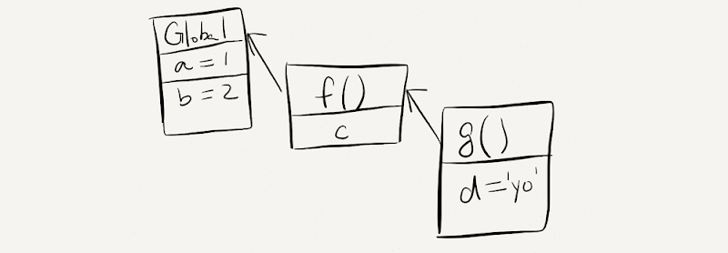

### 一、作用域

> 了解作用域对程序执行的影响及作用域链的查找机制，使用闭包函数创建隔离作用域避免全局变量污染。

作用域（scope）规定了变量能够被访问的“范围”，离开了这个“范围”变量便不能被访问，作用域分为全局作用域和局部作用域。

#### 1.1 局部作用域

局部作用域分为函数作用域和块作用域。

##### 函数作用域

在函数内部声明的变量只能在函数内部被访问，外部无法直接访问。

~~~~
<script>
  // 声明 counter 函数
  function counter(x, y) {
    // 函数内部声明的变量
    let s = x + y;
    console.log(s); // 18
  }

  // 设用 counter 函数
  counter(10, 8);

  // 访问变量 s
  console.log(s); // 报错
</script>
~~~~

1. 函数内部声明的变量，在函数外部无法被访问

2. 函数的参数也是函数内部的局部变量

3. 不同函数内部声明的变量无法互相访问

4. **函数执行完毕后，函数内部的变量实际被清空了** 为后续闭包买下伏笔

   ~~~
   <script>
     {
       // age 只能在该代码块中被访问
       let age = 18;
       console.log(age); // 正常
     }
     
     // 超出了 age 的作用域
     console.log(age); // 报错
     
     let flag = true;
     if(flag) {
       // str 只能在该代码块中被访问
       let str = 'hello world!';
       console.log(str); // 正常
     }
     
     // 超出了 age 的作用域
     console.log(str); // 报错
     
     for(let t = 1; t <= 6; t++) {
       // t 只能在该代码块中被访问
       console.log(t); // 正常
     }
     
     // 超出了 t 的作用域
     console.log(t); // 报错
   </script>
   ~~~

JavaScript 中除了变量外还有常量，常量与变量本质的区别是【常量必须要有值且不允许被重新赋值】，常量值为对象时其属性和方法允许重新赋值。

~~~
    <script>
        // 必须要有值
        const version = '1.0.0';

        // 不能重新赋值
        // version = '1.0.1';
        // 常量值为对象类型
        const user = {
            name: '小明',
            age: 18
        }

        // 不能重新赋值
        user = {};

        // 属性和方法允许被修改
        user.name = '小小明';
        user.gender = '男';
    </script>
~~~

总结：

1. `let` 声明的变量会产生块作用域，`var` 不会产生块作用域
2. `const` 声明的常量也会产生块作用域
3. 不同代码块之间的变量无法互相访问
4. 推荐使用 `let` 或 `const`

注：开发中 `let` 和 `const` 经常不加区分的使用，如果担心某个值会不小被修改时，则只能使用 `const` 声明成常量。

- | 关键字 | 块级作用域 | 变量提升 | 初始值 | 更改值 | 通过window调用 |
  | ------ | :--------: | :------: | :----: | :----: | :------------: |
  | let    |     √      |    ×√    |   -    |  Yes   |       No       |
  | const  |     √      |    ×√    |  Yes   |   No   |       No       |
  | var    |     ×      |    √     |   -    |  Yes   |      Yes       |

#### 1.2 全局作用域

`<script>` 标签和 `.js` 文件的【最外层】就是所谓的全局作用域，在此声明的变量在函数内部也可以被访问。

```html
<script>
  // 此处是全局
  
  function sayHi() {
    // 此处为局部
  }

  // 此处为全局
</script>
```

全局作用域中声明的变量，任何其它作用域都可以被访问，如下代码所示：

```html
<script>
    // 全局变量 name
    let name = '小明';
  
  	// 函数作用域中访问全局
    function sayHi() {
      // 此处为局部
      console.log('你好' + name);
    }

    // 全局变量 flag 和 x
    let flag = true;
    let x = 10;
  
  	// 块作用域中访问全局
    if(flag) {
      let y = 5;
      console.log(x + y); // x 是全局的
    }
</script>
```

总结：

1. 为 `window` 对象动态添加的属性默认也是全局的，不推荐！
2. **函数中未使用任何关键字声明的变量为全局变量，不推荐！！！**
3. 尽可能少的声明全局变量，防止全局变量被污染

JavaScript 中的作用域是程序被执行时的底层机制，了解这一机制有助于规范代码书写习惯，避免因作用域导致的语法错误。

#### 1.3 作用域链

在解释什么是作用域链前先来看一段代码：

```html
<script>
  // 全局作用域
  let a = 1;
  let b = 2;
	
  // 局部作用域
  function f() {
    let c;
    // 局部作用域
    function g() {
      let d = 'yo';
    }
  }
</script>
```

函数内部允许创建新的函数，`f` 函数内部创建的新函数 `g`，会产生新的函数作用域，由此可知作用域产生了嵌套的关系。

如下图所示，父子关系的作用域关联在一起形成了链状的结构，作用域链的名字也由此而来。



作用域链本质上是底层的变量查找机制，在函数被执行时，会优先查找当前函数作用域中查找变量，如果当前作用域查找不到则会依次逐级查找父级作用域直到全局作用域，如下代码所示：

```html
<script>
  // 全局作用域
  let a = 1;
  let b = 2;

  // 局部作用域
  function f() {
    let c;
    // let a = 10;
    console.log(a); // 1 或 10
    console.log(d); // 报错
    
    // 局部作用域
    function g() {
      let d = 'yo';
      // let b = 20;
      console.log(b); // 2 或 20
    }
    
    // 调用 g 函数
    g()
  }

  console.log(c); // 报错
  console.log(d); // 报错
  
  f();
</script>
```

总结：

1. 嵌套关系的作用域串联起来形成了作用域链
2. 相同作用域链中按着从小到大的规则查找变量
3. 子作用域能够访问父作用域，父级作用域无法访问子级作用域（就近原则）