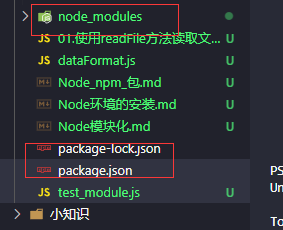
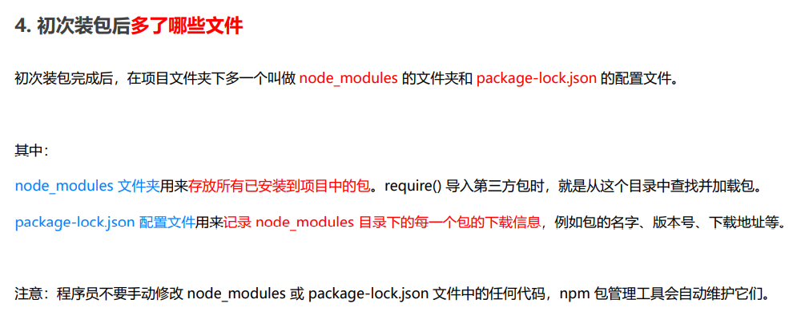
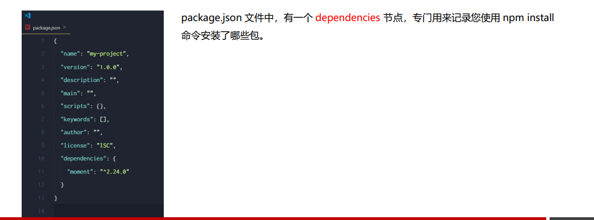
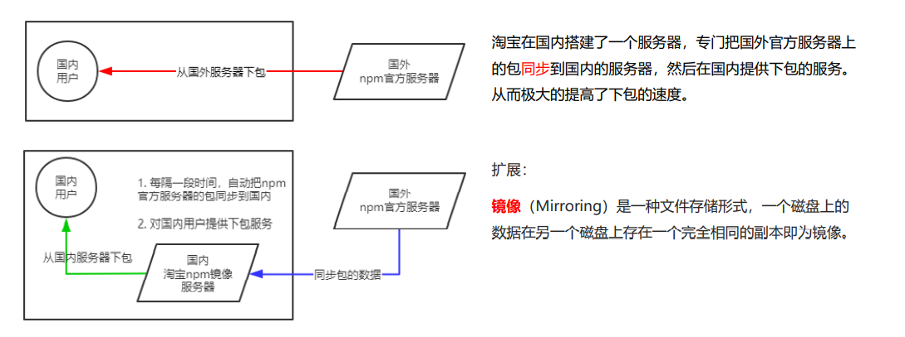
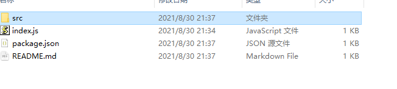
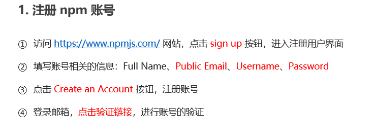
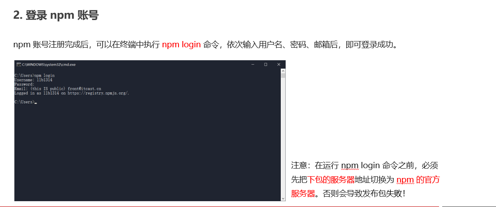
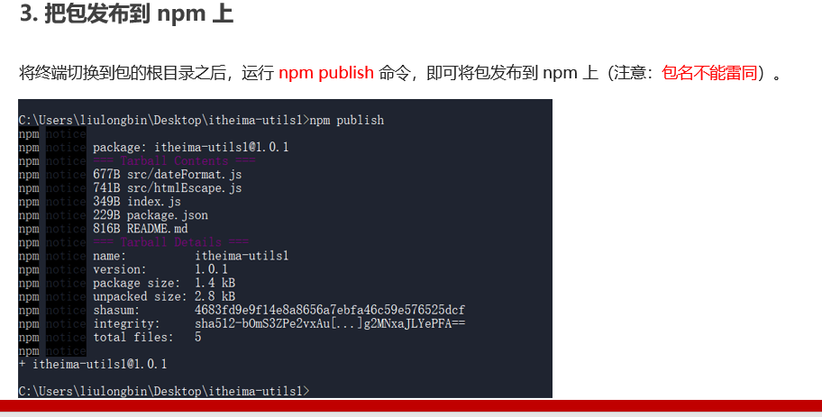
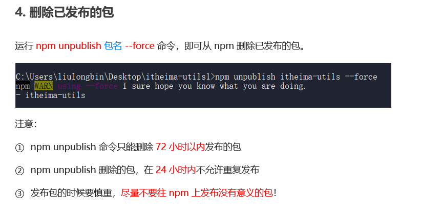

### 包

### 从哪里下载包

国外有一家 IT 公司，叫做 **npm, Inc**. 这家公司旗下有一个非常著名的网站： https://www.npmjs.com/ ，它是**全球最 大的包共享平台**，你可以从这个网站上搜索到任何你需要的包，只要你有足够的耐心！ 

到目前位置，全球约 1100 多万的开发人员，通过这个包共享平台，开发并共享了超过 120 多万个包 供我们使用。 npm, Inc. 公司提供了一个地址为 https://registry.npmjs.org/ 的服务器，来对外共享所有的包，我们可以从这个服务 器上下载自己所需要的包。

注意：

⚫ 从 https://www.npmjs.com/ 网站上搜索自己所需要的包 

⚫ 从 https://registry.npmjs.org/ 服务器上下载自己需要的包

### 如何下载包

npm, Inc. 公司提供了一个包管理工具，我们可以使用这个包管理工具，从 https://registry.npmjs.org/ 服务器把需要 的包下载到本地使用。 

这个包管理工具的名字叫做 Node Package Manager（简称 npm 包管理工具），这个包管理工具随着 Node.js 的安 装包一起被安装到了用户的电脑上。 

大家可以在终端中执行 npm -v 命令，来查看自己电脑上所安装的 npm 包管理工具的版本号

### npm安装包

npm install 包的网址

npm i 完整的包名称

安装完成以后会多出

安装特定版本包

@ 符号指定具体的版本，

~~~
npm i coment@2.22.2
~~~

### 包的语义化版本规范

包的版本号是以“点分十进制”形式进行定义的，总共有三位数字，例如 2.24.0 

其中每一位数字所代表的的含义如下： 

第1位数字：大版本 

第2位数字：功能版本 

第3位数字：Bug修复版本

## 包管理配置文件package.json

npm 规定，在项目根目录中，必须提供一个叫做 package.json 的包管理配置文件。

用来记录与项目有关的一些配置 信息。

例如： 

⚫ 项目的名称、版本号、描述等 

⚫ 项目中都用到了哪些包 

⚫ 哪些包只在开发期间会用到

⚫ 那些包在开发和部署时都需要用到

dependencies 节点

###  如何记录项目中安装了哪些包

在项目根目录中，创建一个叫做 package.json 的配置文件，即可用来记录项目中安装了哪些包。从而方便剔除 node_modules 目录之后，在团队成员之间共享项目的源代码。

 注意：今后在项目开发中，一定要把 node_modules 文件夹，添加到 .gitignore 忽略文件中。

~~~
npm init -y
~~~

注意：

 ① 上述命令只能在英文的目录下成功运行！所以，项目文件夹的名称一定要使用英文命名，不要使用中文，不能出现空格。

 ② 运行 npm install 命令安装包的时候，npm 包管理工具会自动把包的名称和版本号，记录到 package.json 中。

#### 一次性安装所有的包

可以运行 npm install 命令（或 npm i）一次性安装所有的依赖包

#### 卸载包

可以运行 npm uninstall 命令，来卸载指定的包：

~~~
// 使用 npm uninstall 具体的包名来卸载包
npm uninstall moment
~~~

可以运行 npm uninstall 命令，来卸载指定的包：

### devDependencies 节点

如果某些包只在项目开发阶段会用到，在项目上线之后不会用到，则建议把这些包记录到 devDependencies 节点中。

 与之对应的，如果某些包在开发和项目上线之后都需要用到，则建议把这些包记录到 dependencies 节点中。 您可以使用如下的命令，将包记录到 devDependencies 节点中

~~~
安装指定的包，并记录到devDependencies节点中
npm i 包名-D
注意:上述命令是简写形式，等价于卜面完整的写法:
npm install包名--save-dev

~~~

### 总结

~~~
npm install moduleName # 安装模块到项目目录下

 

npm install -g moduleName # -g 的意思是将模块安装到全局，具体安装到磁盘哪个位置，要看 npm config prefix 的位置，具体查看方法是在终端输入npm config edit，在弹出的文档中找到; prefix=C:\node，就是了。

 

npm install -save moduleName # --save 的意思是将模块安装到项目目录下，并在package文件的dependencies节点写入依赖。

 

npm install -save-dev moduleName # --save-dev 的意思是将模块安装到项目目录下，并在package文件的devDependencies节点写入依赖。
~~~

### npm install moduleName 命令

\1. 安装模块到项目node_modules目录下。
\2. 不会将模块依赖写入devDependencies或dependencies 节点。
\3. 运行 npm install 初始化项目时不会下载模块。

### npm install -g moduleName 命令

\1. 安装模块到全局，不会在项目node_modules目录中保存模块包。
\2. 不会将模块依赖写入devDependencies或dependencies 节点。
\3. 运行 npm install 初始化项目时不会下载模块。

### npm install -save moduleName 命令

\1. 安装模块到项目node_modules目录下。
\2. 会将模块依赖写入dependencies 节点。
\3. 运行 npm install 初始化项目时，会将模块下载到项目目录下。
\4. 运行npm install --production或者注明NODE_ENV变量值为production时，会自动下载模块到node_modules目录中。

### npm install -save-dev moduleName 命令

\1. 安装模块到项目node_modules目录下。
\2. 会将模块依赖写入devDependencies 节点。
\3. 运行 npm install 初始化项目时，会将模块下载到项目目录下。
\4. 运行npm install --production或者注明NODE_ENV变量值为production时，不会自动下载模块到node_modules目录中。

**在生产环境，使用`npm install --production`安装 dependencies 部分的模块,在开发环境，npm i ，安装所有devDependencies 和 dependencies里面的模块。**

### 淘宝 NPM 镜像服务器

~~~
1 #查看当前的下包镜像源
2 npm config get registry
3# 将下包的镜像源切换为淘宝镜像源
4 npm config set registry=https://lregistry.npm.taobao.org/
5#检查镜像源是否下载成功
6 npm config get registry

~~~

####  nrm

为了更方便的切换下包的镜像源，我们可以安装 nrm 这个小工具，利用 nrm 提供的终端命令，可以快速查看和切换下 包的镜像源

~~~
1#通过npm包管理器，将nrm安装为全局可用的工具2
npm i nrm -g
3#查看所有可用的镜像源
4 nrm ls
5# 将下包的镜像源切换为taobao镜像
6 nrm use taobao

~~~

### 开发属于自己的包

① 新建 itheima-tools 文件夹，作为包的根目录 

② 在 itheima-tools 文件夹中，新建如下三个文件： 

⚫ package.json （包管理配置文件） 

⚫ index.js （包的入口文件） 

⚫ README.md （包的说明文档）

package.json模板

package.json 中必须包含 name，version，main 这三个属性，分别代表包的名字、版本号、包的入口

~~~
{
  //项目名称
  "name": "demo",
  //版本号（遵守“主版本.次要版本.补丁号”的格式
  "version": "1.0.0",
  //description描述你的模块,或者搜索
  "description": "vue.js js iview ",
  //main字段指定了加载的入口文件，即主文件
  "main": "app.js",
  // scripts指定了运行脚本命令的npm命令行缩写，比如start指定了运行npm start时，所要执行的命令。
  "scripts": {
    "start": "node index.js"
  },
  //repository(仓库)指定一个代码存放地址
  "repository": {
    "type": "git",
    "url": "git+https://github.com/XXXX"
  },
  //作者
  "author": "mayuan",
  //授权方式
  "license": "MIT",
  //指明node.js运行所需要的版本
  "engines": {
      "node": "0.10.x"
  },
  "bugs": {
      "url": "https://github.com/XXXX"
  },
  // 一个字符串数组，方便别人搜索到本模块
  "keywords": [
  "vue","iview"
  ],
 
  //devDependencies指定项目开发所需要的模块
  "devDependencies": {
      "babel-core": "^6.23.1",
      "babel-loader": "^6.3.2",
      "babel-preset-es2015": "^6.22.0",
      "vue-html-loader": "^1.0.0",
      "vue-loader": "^8.5.2",
      "vue-style-loader": "^1.0.0",
      "webpack": "^1.13.2"
  },
  //dependencies字段指定了项目运行所依赖的模块
  "dependencies": {
      "express": "latest", //指定express是最新版本
      "mongoose": "~3.8.3",
      "handlebars-runtime": "~1.0.12",
      "express3-handlebars": "~0.5.0",
      "MD5": "~1.2.0"
  }
}
~~~

**发布包**

### **模块的加载机制**

**模块在第一次加载后会被缓存**。 这也意味着多次调用 require() 不会导致模块的代码被执行多次。

注意：不论是内置模块、用户自定义模块、还是第三方模块，它们都会优先从缓存中加载，从而提高模块的加载效率。

内置模块是由 Node.js 官方提供的模块，**内置模块的加载优先级最高**。

#### **自定义模块****的加载机制**

使用 require() 加载自定义模块时，必须指定以 ./ 或 ../ 开头的路径标识符。在加载自定义模块时，如果没有指定 ./ 或 ../ 这样的路径标识符，则 node 会把它当作内置模块或第三方模块进行加载。

同时，在使用 require() 导入自定义模块时，如果省略了文件的扩展名，则 Node.js 会按顺序分别尝试加载以下的文件：

①按照确切的文件名进行加载

②补全 .js 扩展名进行加载

③补全 .json 扩展名进行加载

④补全 .node 扩展名进行加载

⑤加载失败，终端报错

如果传递给 require() 的模块标识符不是一个**内置模块**，也没有以 ‘./’ 或 ‘../’ 开头，则 Node.js 会从当前模块的父目录开始，尝试从 /node_modules 文件夹中加载第三方模块。

**如果没有找到对应的第三方模块，则移动到再上一层父目录中，进行加载，直到文件系统的根目录**。

例如，假设在 'C:\Users\itheima\project\foo.js' 文件里调用了 require('tools')，则 Node.js 会按以下顺序查找：

① C:\Users\itheima\project\node_modules\tools

② C:\Users\itheima\node_modules\tools

③ C:\Users\node_modules\tools

④ C:\node_modules\tools

当把目录作为模块标识符，传递给 require() 进行加载的时候，有三种加载方式：

①在被加载的目录下查找一个叫做 package.json 的文件，并寻找 main 属性，作为 require() 加载的入口

②如果目录里没有 package.json 文件，或者 main 入口不存在或无法解析，则 Node.js 将会试图加载目录下的 index.js 文件。

③如果以上两步都失败了，则 Node.js 会在终端打印错误消息，报告模块的缺失：Error: Cannot find module 'xxx'