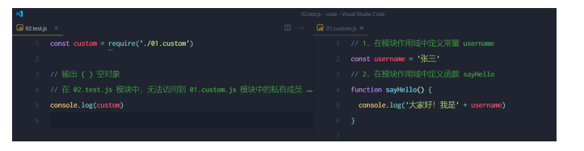
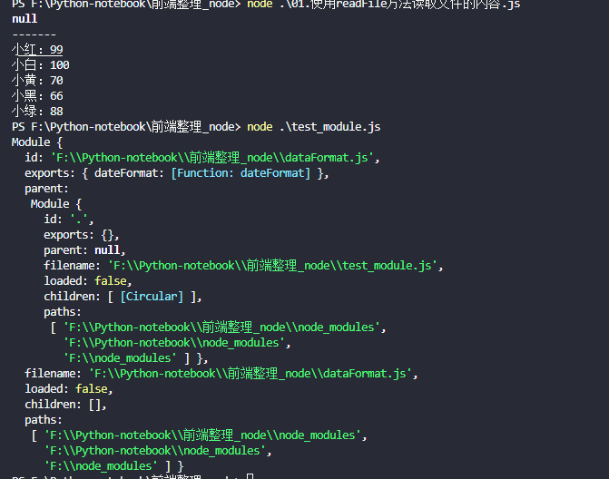
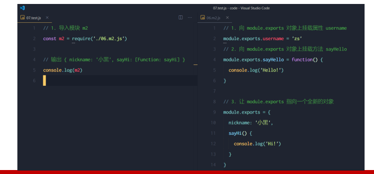
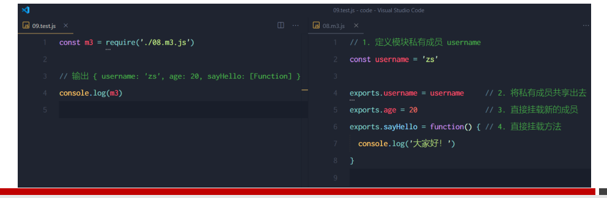
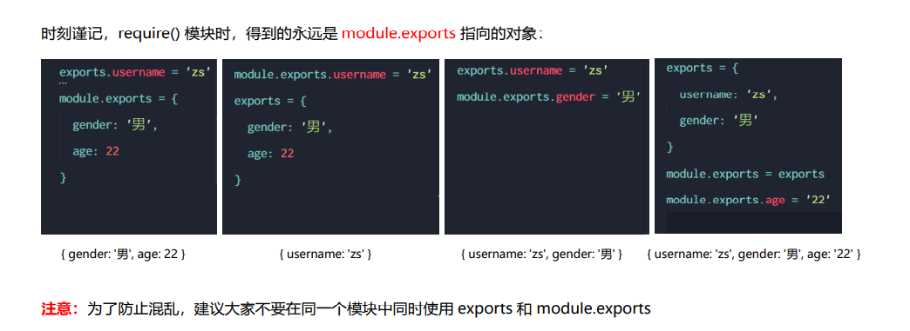

### Node.js 中的模块化 

 Node.js 中模块的分类 Node.js 中根据模块来源的不同，将模块分为了 3 大类，

分别是： 

⚫ 内置模块（内置模块是由 Node.js 官方提供的，例如 fs、path、http 等） 

⚫ 自定义模块（用户创建的每个 .js 文件，都是自定义模块） 

⚫ 第三方模块（由第三方开发出来的模块，并非官方提供的内置模块，也不是用户创建的自定义模块，使用

### 加载模块

使用强大的 require() 方法，可以加载需要的内置模块、用户自定义模块、第三方模块进行使用

**注意**：使用 require() 方法加载其它模块时，会执行被加载模块中的代码

### 什么是模块作用域

防止了全局变量污染的问题

### 向外共享模块作用域中的成员

####  module 对象

在每个 .js 自定义模块中都有一个 module 对象，它里面存储了和当前模块有关的信息，打印如下

#### 共享成员时的注意点

使用 require() 方法导入模块时，导入的结果，永远以 module.exports 指向的对象为

由于 module.exports 单词写起来比较复杂，为了简化向外共享成员的代码，Node 提供了 exports 对象。默认情况 下，exports 和 module.exports 指向同一个对象。最终共享的结果，还是以 module.exports 指向的对象为准

.

####  Node.js 中的模块化规范

Node.js 遵循了 CommonJS 模块化规范，CommonJS 规定了模块的特性和各模块之间如何相互依赖。

 CommonJS 规定： ① 每个模块内部，module 变量代表当前模块。 

② module 变量是一个对象，它的 exports 属性（即 module.exports）是对外的接口。 

③ 加载某个模块，其实是加载该模块的 module.exports 属性。require() 方法用于加载模块