## Node.js安装

###### 1.首先在[Node官网](https://nodejs.org/zh-cn/download/)上下载对应的安装包

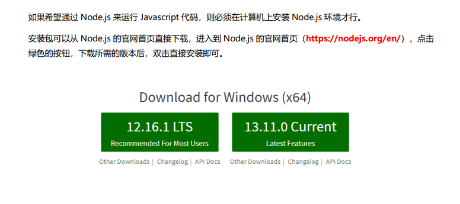

区分 LTS 版本和 Current 版本的不同

① LTS 为长期稳定版，对于追求稳定性的企业级项目来说，推荐安装 LTS 版本的 Node.js。 

② Current 为新特性尝鲜版，对热衷于尝试新特性的用户来说，推荐安装 Current 版本的 Node.js。但是，Current 版本中可 能存在隐藏的 Bug 或安全性漏洞，因此不推荐在企业级项目中使用 Current 版本的 Node.js

###### 2 下一步 下一步

###### 3 在cmd命令行中验证，出现以下情况即表示安装成功

 

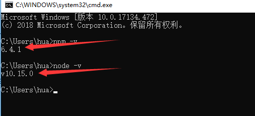

##### Node.js环境变量配置

在以上的步骤已经完成了node.js的安装，即使不进行此步骤的环境变量配置也不影响node.js的使用，但是如果不进行环境变量配置，那么在我们使用命令安装node.js全局模块，例如npm install -g express时，会默认安装到C盘的路径C:\Users\hua\AppData\Roaming\npm中，所以在这边配置全局安装模块以及缓存目录的环境变量；

###### 1.首先在node.js的安装目录新建两个文件夹node_global和node_cache

 

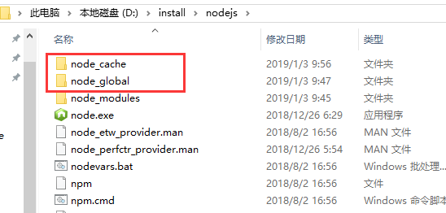

 

###### 2.创建完两个文件夹后，在cmd窗口中输入以下命令（两个路径即是两个文件夹的路径）：


```swift
npm config set prefix "D:\install\nodejs\node_global"
npm config set cache "D:\install\nodejs\node_cache"
```

###### 3.接下来设置电脑环境变量，右键“我的电脑”=》属性=》高级系统设置=》环境变量 进入以下环境变量对话框

 

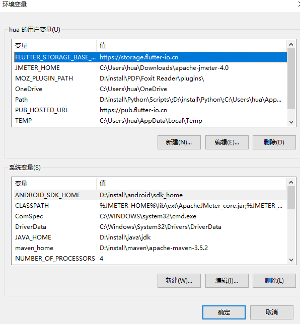

 

###### 4.在【系统变量】新建环境变量 NODE_PATH，值为D:\install\nodejs\node_global\node_modules，其中D:\install\nodejs\node_global是上述创建的全局模块安装路径文件夹

 

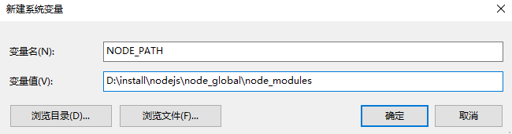

 

###### 5.修改【用户变量】中的path变量，将C:\Users\hua\AppData\Roaming\npm修改为D:\install\nodejs\node_global

 

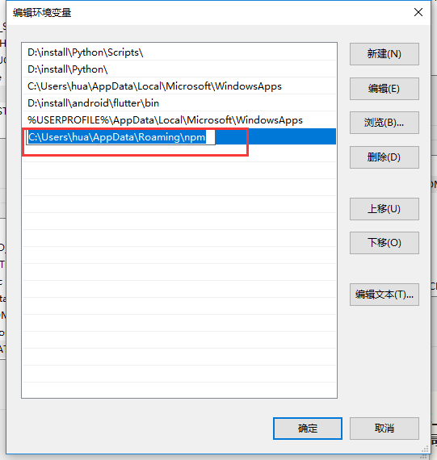

 

 

 

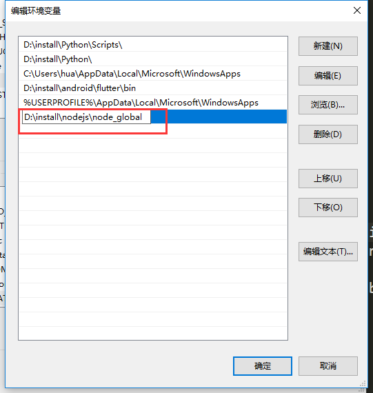

 

###### 6.点击确定后，配置完成。

###### 7.测试是否配置成功，在cmd窗口中输入以下指定全局安装express模块


```bash
npm install -g express     # -g表示是全局安装
```

 

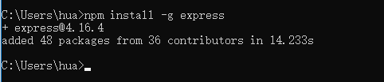

 


 

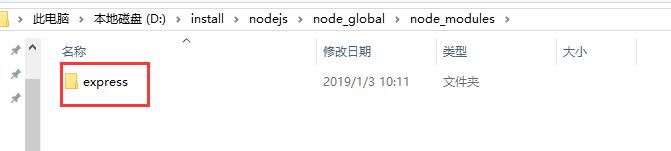

 注意：如果该步骤不成功，出现如下类似报错，别担心：

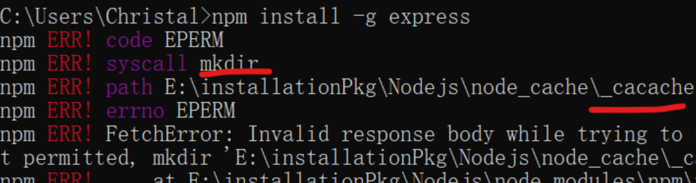

 

 进行如下操作即可： 删除C:\Users\用户\下的**.npmrc文件**

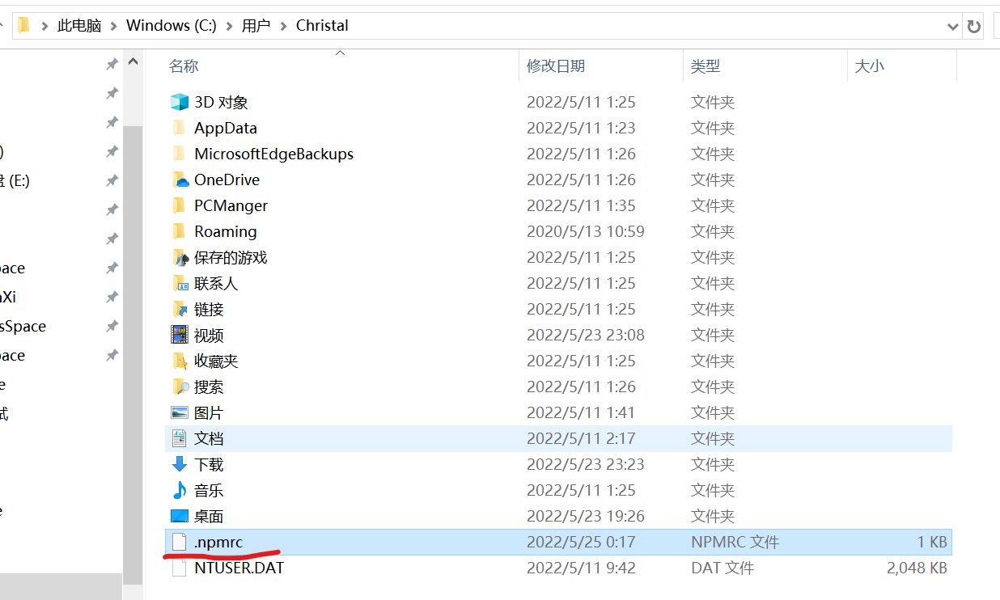

 

 

###### 8.可以看出，node.js环境变量配置成功。至此，node.js安装和环境变量配置完成。

##### 国内镜像网站配置

我们通过npm命令下载node模块的时候因为访问的是国外网站，所以可能会出现下载的很缓慢或者干脆是直接下载失败，在这种情况下，我们可以通过配置国内镜像来解决，一般配置的是[淘宝npm镜像](http://npm.taobao.org/)

***一般场景：\***

###### 1.通过以下命令配置淘宝镜像


```cpp
npm install -g cnpm --registry=https://registry.npm.taobao.org
```

###### 2.以后下载模块的时候，将npm替换成cnpm即可从淘宝镜像中下载模块，例如


```undefined
cnpm install
```

**注意**：如果npm i -g express卡住了，多半是网速问题，更改为淘宝镜像再install即可

***特殊场景：\***

**1. 进行React Native开发时，要注意不推荐使用cnpm下载，需要使用如下方式配置，直接永久地使用淘宝的镜像源**

npm config set registry https://registry.npm.taobao.org
