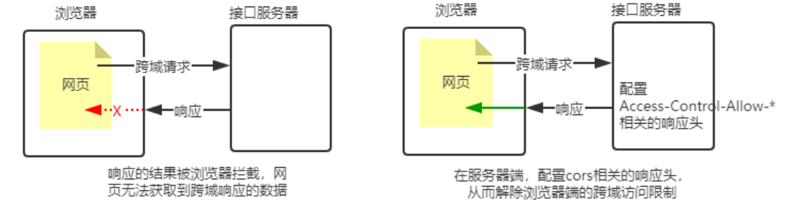
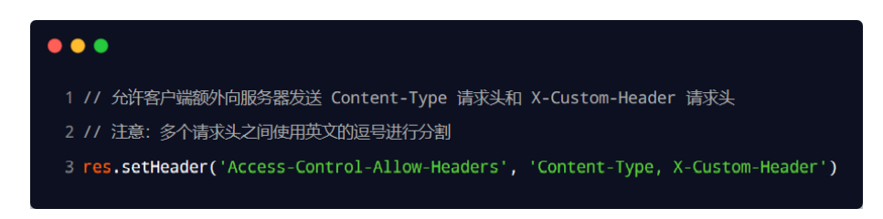
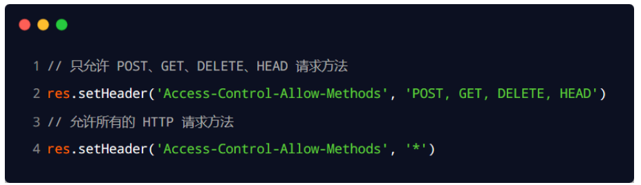

### OCR跨域问题

使用 cors 中间件解决跨域问题 cors 是 Express 的一个第三方中间件。

通过安装和配置 cors 中间件，可以很方便地解决跨域问题。 

使用步骤分为如下 3 步： 

① 运行 npm install cors 安装中间件 

② 使用 const cors = require('cors') 导入中间件 

③ 在路由之前调用 app.use(cors()) 配置中间件

### 什么是 CORS

CORS （Cross-Origin Resource Sharing，跨域资源共享）由一系列 HTTP 响应头组成，这些 HTTP 响应头决定 浏览器是否阻止前端 JS 代码跨域获取资源。 浏览器的同源安全策略默认会阻止网页“跨域”获取资源。但如果接口服务器配置了 CORS 相关的 HTTP 响应头， 就可以解除浏览器端的跨域访问限制

CORS 的注意事项 

① CORS 主要在**服务器端进行配**置。客户端浏览器无须做任何额外的配置，即可请求开启了 CORS 的接口。

 ② CORS 在浏览器中有兼容性。只有支持 XMLHttpRequest Level2 的浏览器，才能正常访问开启了 CORS 的服 务端接口（例如：IE10+、Chrome4+、FireFox3.5+）

### 加入请求头

响应头部中可以携带一个 Access-Control-Allow-Origin 字段

下面的字段值将只允许来自 http://itcast.cn 的请求

~~~
res.setHeader( ' Access-Control-Allow-Origin', 'http:/litcast.cn')
~~~

如果指定了 Access-Control-Allow-Origin 字段的值为通配符 *，表示允许来自任何域的请求

~~~
res.setHeader( ' Access-Control-Allow-Origin', '*')
~~~

#### 而外的请求头需要自己添加

默认情况下，CORS 仅支持客户端向服务器发送如下的 9 个请求头： Accept、Accept-Language、Content-Language、DPR、Downlink、Save-Data、Viewport-Width、Width 、 Content-Type （值仅限于 text/plain、multipart/form-data、application/x-www-form-urlencoded 三者之一） 如果客户端向服务器发送了额外的请求头信息，则需要在服务器端，通过 Access-Control-Allow-Headers 对额外 的请求头进行声明，否则这次请求会失败！

### CORS 响应头部 - Access-Control-Allow-Methods

 默认情况下，CORS 仅支持客户端发起 GET、POST、HEAD 请求。 如果客户端希望通过 PUT、DELETE 等方式请求服务器的资源，则需要在服务器端，通过 Access-Control-Alow-Methods 来指明实际请求所允许使用的 HTTP 方法。

### CORS请求的分类

#### 简单请求 

同时满足以下两大条件的请求，就属于简单请求：

 ① 请求方式：GET、POST、HEAD 三者之一 

 ② HTTP 头部信息不超过以下几种字段：无自定义头部字段、Accept、Accept-Language、Content-Language、DPR、 Downlink、Save-Data、Viewport-Width、Width 、Content-Type（只有三个值application/x-www-formurlencoded、multipart/form-data、text/plain）

#### 预检请求

只要符合以下任何一个条件的请求，都需要进行预检请求：

 ① 请求方式为 GET、POST、HEAD 之外的请求 Method 类型

 ② 请求头中包含自定义头部字段 

③ 向服务器发送了 application/json 格式的数据 

在浏览器与服务器正式通信之前，浏览器会先发送 OPTION 请求进行预检，以获知服务器是否允许该实际请求，所以这一 次的 OPTION 请求称为“预检请求”。服务器成功响应预检请求后，才会发送真正的请求，并且携带真实数据。

#### 区别

简单请求的特点：客户端与服务器之间只会发生一次请求。 

预检请求的特点：客户端与服务器之间会发生两次请求，OPTION 预检请求成功之后，才会发起真正的请求。