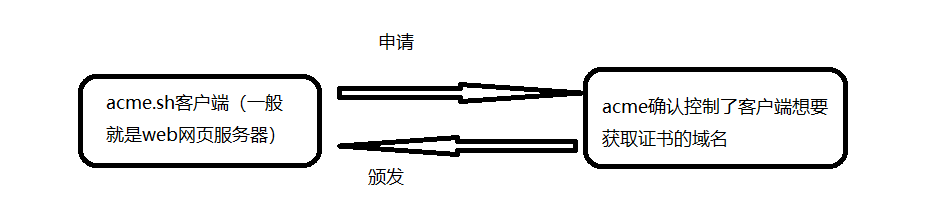
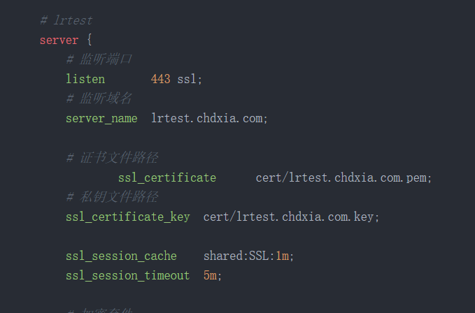

> ACME协议是如何工作的
>  正是由于以上人工管理SSL证书的的诸多不变，催生了ACME协议的诞生，它使我们能够在没有任何人为干预的情况下，从证书颁发机构即时获取证书。
>
>  ACME协议是由著名的Let's Encrypt开发的，它是一个免费的证书颁发机构。
>
>  ACME协议有两个关键部分，一个是ACME客户端，一个是ACME服务端。ACME服务端是一个证书颁发机构，能够自动颁发签名证书。比如，Let’s Encrypt就是一个ACME服务端。ACME客户端通常在web服务器上运行，它向ACME服务端证明web服务器确认控制了客户端想要获取证书的域名。一旦证明了这一点，ACME客户端就可以请求、续签和吊销证书。
>
> 创建一个账户。ACME客户端使用ACME协议创建一个账户。首先，ACME客户端要生成一个密钥对，然后向ACME服务端发送一个帐户创建请求。这个帐户创建请求将包含生成的公钥，并将使用生成的私钥对其进行签名。因此，这个私钥实际上将用于对所有ACME客户端请求进行签名。也就是说，这是ACME服务端识别ACME客户端的方式。当然，这个帐户创建请求也可以包含联系人信息。例如，如果此帐户存在任何问题，可以使用电子邮件地址通知管理员。请注意，帐户的创建步骤只需执行一次。因此，一旦ACME客户端在ACME服务端创建了一个帐户，就可以开始执行证书管理操作了。
> 验证所有权。首先，ACME客户端向服务端发送一个请求，该请求表明ACME客户端希望为其获取证书的域名。接下来，ACME服务端将向客户端提供一些验证来响应此请求，以证明web服务器确实控制着某个域名。ACME服务端可能会要求ACME客户端在特定位置提供具有特定内容的HTTP资源，或者要求它提供具有特定内容的DNS记录。ACME客户端只需要响应其中一个验证，就可以证明域名的所有权。如果确实如此，那么ACME服务端就知道web服务器确实是该域名的拥有者。
> 颁发证书。一旦ACME客户端成功地证明了域名的所有权，它就会生成一个密钥对，也就是私钥和公钥，而公钥则会用于生成一个证书签名请求，并将证书签名请求发送到ACME服务端。同样，整个请求都是使用ACME客户端的帐户私钥签名的。因此，ACME服务端随后将验证签名。而且，如果一切正常，它将继续发出签名证书，然后ACME客户端可以下载该证书。




 最后，请记住签名证书仅在一定时间段内有效。当然，当需要续订证书时，我们刚才看到的请求证书的过程也可以用于续订证书。而且，整个证书管理过程实际上可以完全自动化！因此，ACME客户端可用于请求和续订证书，而整个过程都是自动的，不需要任何人为干预，这显然比传统的证书管理简单得多！


### 1 安装 acme.sh

安装很简单, 一个命令:

```
curl https://get.acme.sh | sh -s email=my@example.com
```

~~~
wget -O -  https://get.acme.sh | sh -s email=my@example.com
~~~

如果用不了在线的就下载到本地让后拖到文件夹安装

~~~
git clone https://github.com/acmesh-official/acme.sh.git
cd ./acme.sh
./acme.sh --install -m my@example.com
~~~

安装将执行 3 个操作：

1. 创建并复制到您的主页目录 （）：。 所有证书也将放在此文件夹中。`acme.sh``$HOME``~/.acme.sh/`
2. 为以下内容创建别名：`acme.sh=~/.acme.sh/acme.sh`
3. 创建每日 cron 作业以根据需要检查和续订证书。


下个命令可以查看帮助

```
acme.sh -h
```

### 2 生成证书 我们使用 阿里云的

~~~
# 由于acme协议和letsencryptCA都在频繁的更新,开启acme.sh自动升级
acme.sh  --upgrade  --auto-upgrade
~~~


不同运营看这个文章[dnsapi · acmesh-official/acme.sh Wiki (github.com)](https://github.com/acmesh-official/acme.sh/wiki/dnsapi)

https://ram.console.aliyun.com/users

获得 账号的账号密码

再终端输入变量


~~~
   52  export Ali_Secret="kttd1mwj*****oQhluzrq"
   53  export Ali_Key="LTAI5tR4tbtQ1H*****VMqrz"
~~~

`Ali_Key` and `Ali_Secret`存入account.conf将在需要时重复使用

让后申请证书 注意dns

*# SSL 证书正式签发*

~~~
acme.sh --issue --dns dns_ali -d book.960pk.com--webroot /www/wwwroot/book.1mir.net
~~~

*# SSL 证书配置生成.crt和.key文件*

~~~
acme.sh --install-cert -d book.960pk.com --key-file  /www/wwwroot/book.1mir.net/key.pem  --fullchain-file /www/wwwroot/book.1mir.net/cert.pem --reloadcmd "service nginx force-reload"
~~~

后面就是nginx安装真是



~~~
   # ssl 证书地址
    ssl_certificate /usr/local/nginx/cert/fullchain.cer;
    ssl_certificate_key /usr/local/nginx/cert/cert.key;
~~~

~~~
server
{
    listen 80;
		listen 443 ssl http2;
    server_name book.1mir.net book.960pk.com;
    index index.php index.html index.htm default.php default.htm default.html;
    root /www/wwwroot/book.1mir.net;

    #SSL-START SSL相关配置，请勿删除或修改下一行带注释的404规则
    #error_page 404/404.html;
    #HTTP_TO_HTTPS_START
    if ($server_port !~ 443){
        rewrite ^(/.*)$ https://$host$1 permanent;
    }
    #HTTP_TO_HTTPS_END
    ssl_certificate    /www/server/panel/vhost/cert/book.1mir.net/fullchain.pem;
    ssl_certificate_key    /www/server/panel/vhost/cert/book.1mir.net/privkey.pem;
    ssl_protocols TLSv1.1 TLSv1.2 TLSv1.3;
    ssl_ciphers EECDH+CHACHA20:EECDH+CHACHA20-draft:EECDH+AES128:RSA+AES128:EECDH+AES256:RSA+AES256:EECDH+3DES:RSA+3DES:!MD5;
    ssl_prefer_server_ciphers on;
    ssl_session_cache shared:SSL:10m;
    ssl_session_timeout 10m;
    add_header Strict-Transport-Security "max-age=31536000";
    error_page 497  https://$host$request_uri;
		#SSL-END

    #ERROR-PAGE-START  错误页配置，可以注释、删除或修改
    #error_page 404 /404.html;
    #error_page 502 /502.html;
    #ERROR-PAGE-END

    #PHP-INFO-START  PHP引用配置，可以注释或修改
    #清理缓存规则

    location ~ /purge(/.*) {
        proxy_cache_purge cache_one $host$1$is_args$args;
        #access_log  /www/wwwlogs/book.1mir.net_purge_cache.log;
    }
	#引用反向代理规则，注释后配置的反向代理将无效
	include /www/server/panel/vhost/nginx/proxy/book.1mir.net/*.conf;

	include enable-php-00.conf;
    #PHP-INFO-END

    #REWRITE-START URL重写规则引用,修改后将导致面板设置的伪静态规则失效
    include /www/server/panel/vhost/rewrite/book.1mir.net.conf;
    #REWRITE-END

    #禁止访问的文件或目录
    location ~ ^/(\.user.ini|\.htaccess|\.git|\.env|\.svn|\.project|LICENSE|README.md)
    {
        return 404;
    }

    #一键申请SSL证书验证目录相关设置
    location ~ \.well-known{
        allow all;
    }

    #禁止在证书验证目录放入敏感文件
    if ( $uri ~ "^/\.well-known/.*\.(php|jsp|py|js|css|lua|ts|go|zip|tar\.gz|rar|7z|sql|bak)$" ) {
        return 403;
    }

    access_log  /www/wwwlogs/book.1mir.net.log;
    error_log  /www/wwwlogs/book.1mir.net.error.log;
}
~~~

