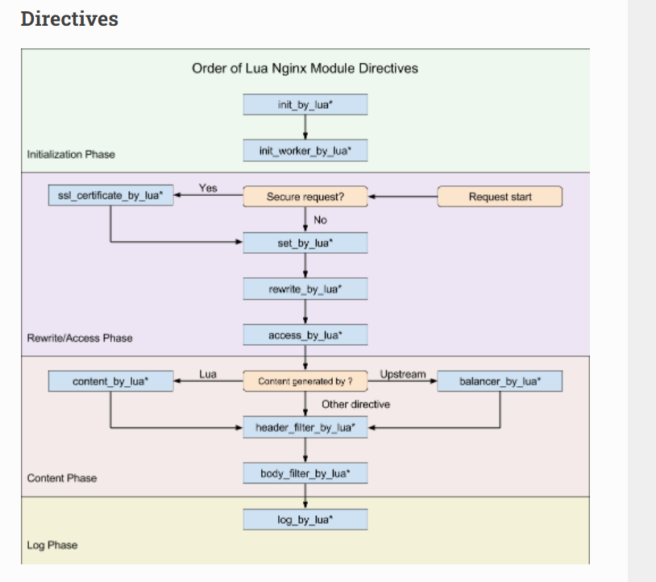

也是




# ngx

上面的配置中已经看到ngx的一些属性和方法了，例如`say` `print`可以作为content返回，`redirect`可以实现跳转，`ngx.location.capture`可以请求一个url，一般是内部url。`exit`可以返回状态码，`shared`可以作为一个所有进程共享的缓存kv池。

再来看看其他的一些常见用法。
# log
ngx.log(ngx.INFO, "日志内容") 级别有ngx.STDERR ngx.EMERG ngx.ALERT ngx.CRIT ngx.ERR ngx.WARN ngx.NOTICE ngx.INFO ngx.DEBUG
# var与ctx
`ngx.var`可以获取或者修改nginx上下文的`$xx`变量，包括内置的变量，和在location范围内set的变量。nginx上下文的变量[参考](https://www.jianshu.com/p/a4f76500a0ac)

一个request上下文的ngx.ctx是一个table可以自由的赋值和获取。例如rewrite_by_lua中ngx.ctx.a=10, content_by_lua中能拿到ngx.ctx.a。
# location.capture
```
local res = ngx.location.capture('/foo?a=1&b=3&c=%3a') -- get请求, res有status body header和truncated属性

ngx.req.set_header("Content-Type", "application/json")
ngx.location.capture('/foo/bar',{ method = ngx.HTTP_POST, body = cjson.encode({a = 'hello, world' })) --post
```
# req
- ngx.req.get_method() 返回大写的字符串GET
- ngx.req.get_headers() 返回 kv table
- ngx.req.set_header(k, v) 
- ngx.req.get_body_data() 返回是string
- ngx.req.get_uri_args() get查询参数，返回table
- ngx.req.get_post_args() form类型的post，返回table,err

# hash与编码
- newstr = ngx.encode_base64(str, no_padding?)
- newstr = ngx.decode_base64(str)
- digest = ngx.md5(str)
- str = ngx.encode_args(table)
- table = ngx.decode_args(str, max_args?)
- newstr = ngx.escape_uri(str)
- newstr = ngx.unescape_uri(str)

# re正则（个人感觉lua自带的正则已经够用了）
-  local m, err = ngx.re.match("hello, 1234", "[0-9]{3}") -- m[0] == "123" 这个正则比lua自带的正则强一点
-  local from, to, err = ngx.re.find(s, "([0-9]+)", "jo")
-  local iterator, err = ngx.re.gmatch("hello, world!", "([a-z]+)", "i")
-  local newstr, n, err = ngx.re.sub("hello, 1234", "([0-9])[0-9]", "[$0][$1]")

# os相关的
- ngx.sleep(n) 单位是s
- ngx.time() ngx.utctime()ngx.now() ngx.today()... 时间相关的
- ngx.exec("shell")