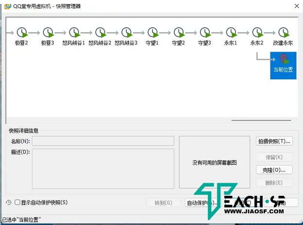
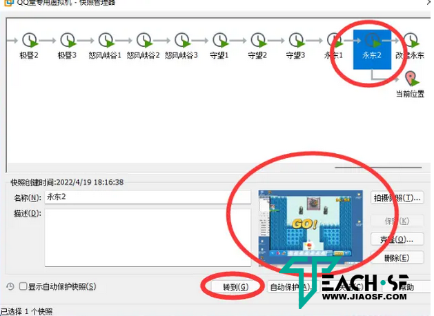
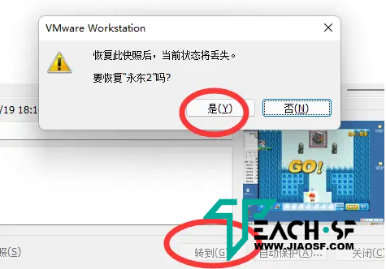
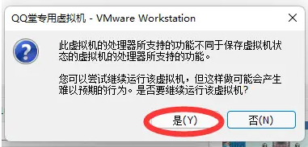
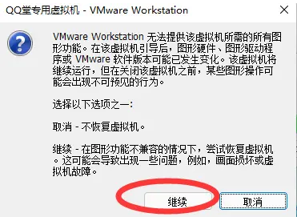
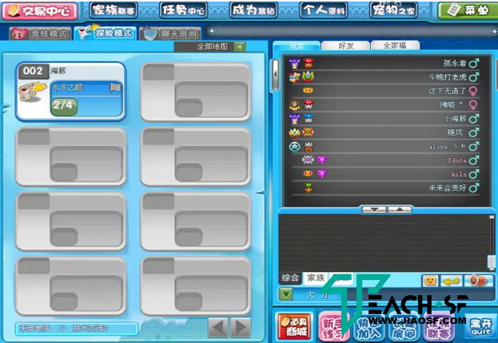

**看到好多人都不知道怎么玩我发的《QQ堂》单机一键端，特出此文字教程！
**

**一、安装VM和下载带快照的虚拟机**

**游戏下载地址：https://www.jiaosf.com/sf-42899-1.html**

**二、当我们搞完第一步用VM打开快照虚拟机
1.点左上角 虚拟机（M）选项
2.点快照
3.点快照管理器**

****

**4.点我们想玩的快照**

****

**5.点快照管理器中间靠下的 转到(G)
6.点是(Y)**

****

**7.点是(Y)**

****

**8.点继续**

****

**然后就可以玩了，如果想玩其他地图就按照上述操作选其他快照**

****